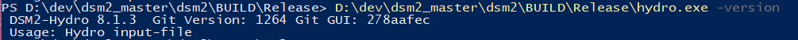
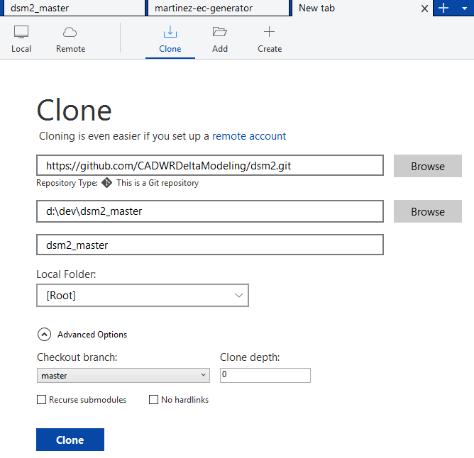
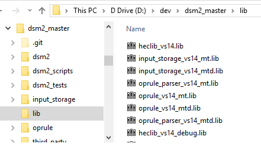

# DSM2 v82 Compiling and Packaging

This memo presents step-by-step instruction on compiling and packaging
DSM2 version 8 assuming a minor (bug-fix) release. 

# **Version**

The latest DSM2 release version is 8.2.0. The first two digits of DSM2
official version; the 3rd digit is used for minor (bug-fix)
releases.

git commit number is also embedded for developer's record, and could be
used to check thru '-version' command.

The Git number is embedded automatically at compilation time. The
following 3 files contains relevant version info:  
 \dsm2\src\common\version_generate.py  
 \dsm2_distribute\dsm2\install\copy_hydro_qual_ptmDLL_notepad_style.bat  
 \dsm2_distribute\dsm2\install\DSM2setup_Script_Generate.py

\*BDO is using an 'unstable trunk' branching strategy in GIT for DSM2
development.  
\*GIT categories: master is for major development and bug fix; branches
are usually for separate and time-consuming studies on old versions;
Tags are the records for all release versions.  
\*DSM2 version tag (the 3rd digit in the version number) is
designed to use odd number for internal use, and even number for formal
release 

  

# **Checkout**

Checkout DSM2 from github:
**<a href="https://github.com/CADWRDeltaModeling/dsm2.git"
rel="nofollow">https://github.com/CADWRDeltaModeling/dsm2.git</a>**

place the project in local directory, e.g. D:\dev\dsm2_master\\

  

Check out could be conduct at command line

    git clone https://github.com/CADWRDeltaModeling/dsm2.git

Or use software sourceTree (recommended for later use). Note which
branch you're checking out (master by default).

  

  

# **Compile**

Cmake is currently used to control and adapt project compilation (see
details at [CMake Build](CMake_Build)).

From command line, run cmake batch at the project root path. It calls
cmake build of oprule, input_storage, then DSM2 sequentially.

    build_all.bat

The building results are exe of hydro and qual, with dll of ptm, under
path \BUILD\Release or Debug

The major part of PTM module is written in Java programming language and
placed in the source code folder: \dsm2_v8_1\src\ptm. It could be
build in two ways:

-   ANT: the default compiling procedure is set in build.xml; open the
    command window and run 'ant' (build.xml as default running file) at
    current path. The release version of compiled application file will
    be automatically placed in the folder: \dsm2_v8_0\src\ptm\lib
    (ptm.jar)
-   Eclipse: [DSM2 v82 PTM Compiling with
    Eclipse](DSM2_v82_PTM_Compiling_with_Eclipse)

  

  

  

  

# **Libraries**

All the libraries DSM2 needs are precompiled and placed in the folder
lib: input storage, oprule, and third parties

If compiling is required, refer their compile details at [CMake
Build](CMake_Build).  
  

  

Since third_party folder is very big and not easy to copy around, one
way to share the same package (w/o increase disk occupance) is to use
Windows mklink

Use admin right to open a command window and type in:

mklink /D {target location}\third_party {original location}\third_party

For internal users use this command

mklink /D
third_party \\cnrastore-bdo\Delta_Mod\Share\DSM2\compile_support\third_party

  

  

# **Debug**

Cmake also built up the project Visual Studio solution, which could be
used do the code debug.

See the following example for debug setting in Visual Studio 2015.

  

Make sure the 'debug info' is on the project you're working on (the
current VS set it as off by default).

  

# **Packaging**

Download from share folder and change folder name to dsm2_distribute\\

under branch (e.g. master), aside with dsm2

  

1\. Generate tutorial PDF files:

a\) Delete all PDF files in "dsm2_distribute\dsm2\tutorials\pdf"

b\) Run "doc2pdf.vbs" in "\dsm2_distribute\dsm2\install\\ to generate
PDFs from tutorial word documents.

  

2\. Copy compiled binaries to distribution folder:

a\) Check the DSM2 version and paths to the compiled binaries are
correct in the batch file "copy_hydro_qual_ptmDLL_notepad_style.bat" in
the folder \dsm2_distribute\dsm2\install\\

Be aware of the version consistence for the 3 control files mentioned in
'DSM2 Versioning'; if not, correct them and re-compile from 6-4 in the
previous section

b\) Run the batch file "copy_hydro_qual_ptmDLL_notepad_style.bat".

  
   
   
Manually copy hydro.exe, qual.exe, ptm.dll, ptm.jar to the folder  
 \dsm2_distribute\dsm2\bin

  

3\. Generate packaging script:

a\) Check the DSM2 version is correct in the Python script
"DSM2setup_Script_Generate.py" in the folder
\dsm2_distribute\dsm2\install\\

Be aware of the version consistence for the 3 control files mentioned in
'DSM2 Versioning'; if not, correct them and re-compile from 6-4 in the
previous section

b\) Run this Python script to generate Inno Setup script
"DSM2setup_v8.iss".

  

4\. Create DSM2 installation file:

 Run "DSM2setup_v8.iss" with Inno Setup Compiler v5.2.3  
The installation file named "DSM2setup_8.X.Xrelease.XXXX.exe" will be
created in the same folder, \dsm2_distribute\dsm2\install\\  
   
 

  

5\. Quick-test installer:

Test installation on a clean machine. Run historical hydro, qual_ec and
ptm on study templates.

  

6\. Tag and version increment:

Create release tag for both "dsm2" source code on github and
"dsm2_distribute" folders on share-folder. 

  
   

  
 

For future usage, immediately increment DSM2 version number (3rd digit
to the next odd number) in the following three files:

-   \dsm2\src\common\version_generate.py  
-   \dsm2_distribute\dsm2\install\copy_hydro_qual_ptmDLL_notepad_style.bat
     
-   \dsm2_distribute\dsm2\install\DSM2setup_Script_Generate.py

  

  

  

## Attachments:

[debug_on.PNG](attachments/87228896/87228895.png) (image/png)  

[package1.PNG](attachments/87228896/87228997.png) (image/png)  

[debug1.png](attachments/87228896/87228898.png) (image/png)  

[debug.png](attachments/87228896/87228899.png) (image/png)  

[vers.PNG](attachments/87228896/87228900.png) (image/png)  

[lib.PNG](attachments/87228896/87228901.png) (image/png)  

[local1.PNG](attachments/87228896/87228902.png) (image/png)  

[github.PNG](attachments/87228896/87228903.png) (image/png)  

[srctree0.PNG](attachments/87228896/87228904.png) (image/png)  

[local0.PNG](attachments/87228896/87228905.png) (image/png)  

[image2017-6-13_15-47-59.png](attachments/87228896/87228906.png)
(image/png)  

[image2017-6-13_15-47-43.png](attachments/87228896/87228907.png)
(image/png)  

[image2017-6-13_15-47-35.png](attachments/87228896/87228908.png)
(image/png)  

[image2017-6-13_15-47-17.png](attachments/87228896/87228909.png)
(image/png)  

[image2017-6-13_15-46-58.png](attachments/87228896/87228910.png)
(image/png)  

[worddav07c1c902559a15d9cb8d941d966322cb.png](attachments/87228896/87228911.png)
(image/png)  

[worddavb0ec1d6cc7478dc4ec73bc27abb42880.png](attachments/87228896/87228912.png)
(image/png)  

[worddav0037c3b8067a8dd0d52094029690277b.png](attachments/87228896/87228913.png)
(image/png)  

[worddav490ef33751ab42acaa896e9bb7dc2dc7.png](attachments/87228896/87228914.png)
(image/png)  

[worddav73b529f2e3382f4bb77f505185a10945.png](attachments/87228896/87228915.png)
(image/png)  

[worddavc7e39738a4a8caa213b31d248d81f87b.png](attachments/87228896/87228916.png)
(image/png)  

[worddavb58034debe15b3d2514f722580c782ad.png](attachments/87228896/87228917.png)
(image/png)  

[worddav1c1324ef8177e0822bb62d9cdf8fdb05.png](attachments/87228896/87228918.png)
(image/png)  

[worddava9503121f9ac50fd0060de1b95c6decc.png](attachments/87228896/87228919.png)
(image/png)
