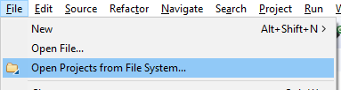
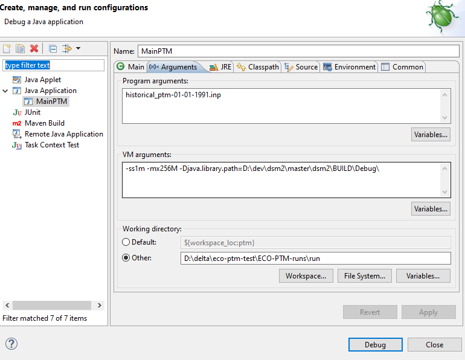
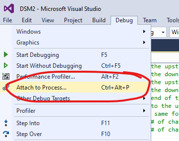
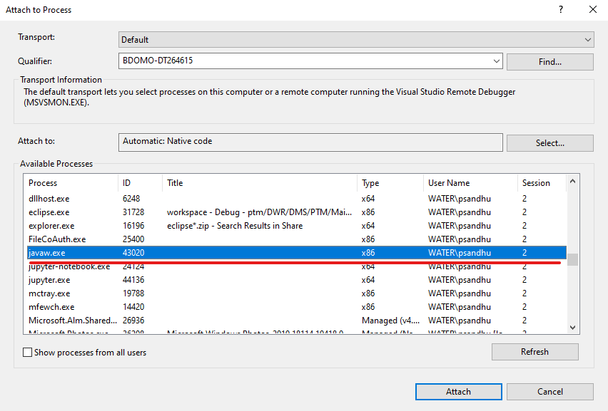
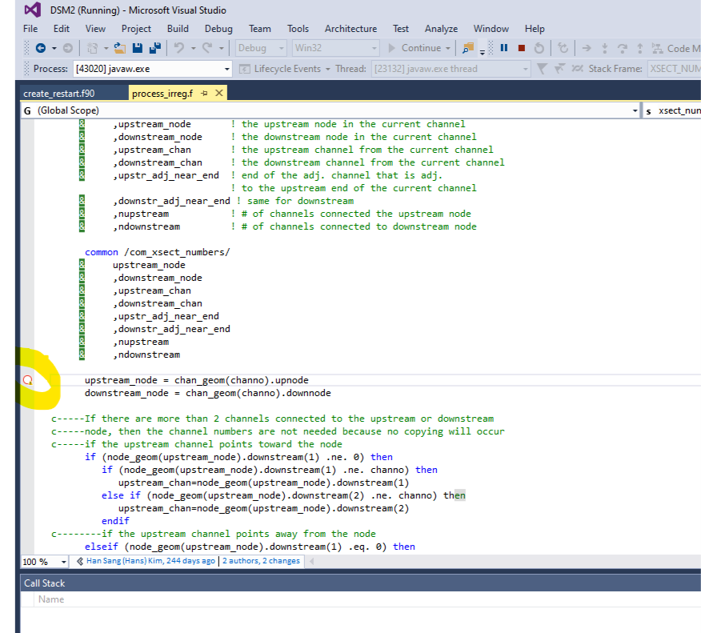

# Debugging JNI code with Eclipse and Visual Studio (20xx)

This document shows how to setup an Eclipse project (e.g. PTM) with JNI
(native C/C++/Fortran code) with Visual Studio (e.g. 2015)

1. Use 32 bit version of Eclipse (e.g. eclipse-java-neon-2-win32) and
    setup PTM project
    1. 

        Browse over to the checked out version of dsm2 and look under
        dsm2/src/ptm.
    2. Create a debug configuration. Make sure to point to the
        directory where PTM.dll is built in debug mode. E.g.
        d:\dev\dsm2\master\dsm2\BUILD\Debug\\ is where cmake builds the
        Debug version of the projects
        

2. Start debug from Eclipse and make sure to pause on some line of code
    before JNI code is invoked.

3. Use Visual Studio code and make sure to be in Debug configuration.
    Then attach to the running Java process in 2 using the remote attach
    to process
    
    

    You will need to be able to identify the process in 2 by its PID or
    its name.

4. Set breakpoint in native code
    

5. Release the paused Java code in the Eclipse debugger. When the
    native code trigger is hit it will stop at the above breakpoint.

## Attachments

- 
- 
- 
- 
- 
