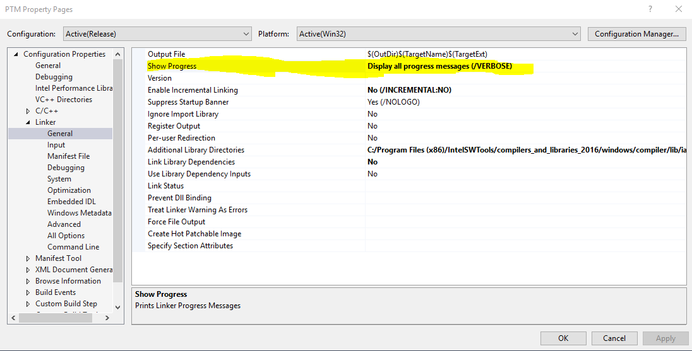

# PTM DLL Static Build

On windows it is not straightforward to compile to a DLL by mixing /MT
(static) and /MD (dynamic) linking flags. However we want to create exes
(hydro, qual, gtm) that have no dependencies on system libraries at
runtime. This means we compile all libraries with /MT flags.

DSM2-174 - PTM DLL compiling issue Resolved

PTM is a dll so we have to override the libraries the compiler and
linker search for by default.

For the standard C/C++ libraries more information at <a
href="https://docs.microsoft.com/en-us/cpp/c-runtime-library/crt-library-features?view=vs-2019"
rel="nofollow">https://docs.microsoft.com/en-us/cpp/c-runtime-library/crt-library-features?view=vs-2019</a>

For the Intel libraries more information at <a
href="https://software.intel.com/en-us/articles/libraries-provided-by-intelr-c-compiler-for-windows-and-intel-parallel-composer"
rel="nofollow">https://software.intel.com/en-us/articles/libraries-provided-by-intelr-c-compiler-for-windows-and-intel-parallel-composer</a>

The following libraries are then ignored so that the static versions of
the libraries are packaged into the .dll file itself. This increases the
size of the DLL but then during runtime there are no other dependencies
on any system or intel libraries. In other words, it can stand alone and
run.

The libraries ignored are 

    msvcrt.lib;libmmd.lib; mscvcprt.lib;libucrtd.lib;

  

  

If you ever need to see all the libraries being used turn the /VERBOSE
feature on the linker options in Visual Studio

## Attachments:

