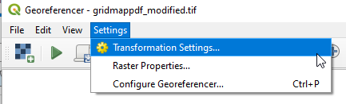
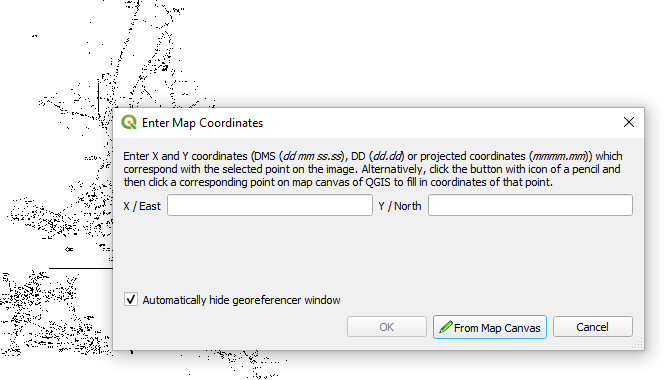
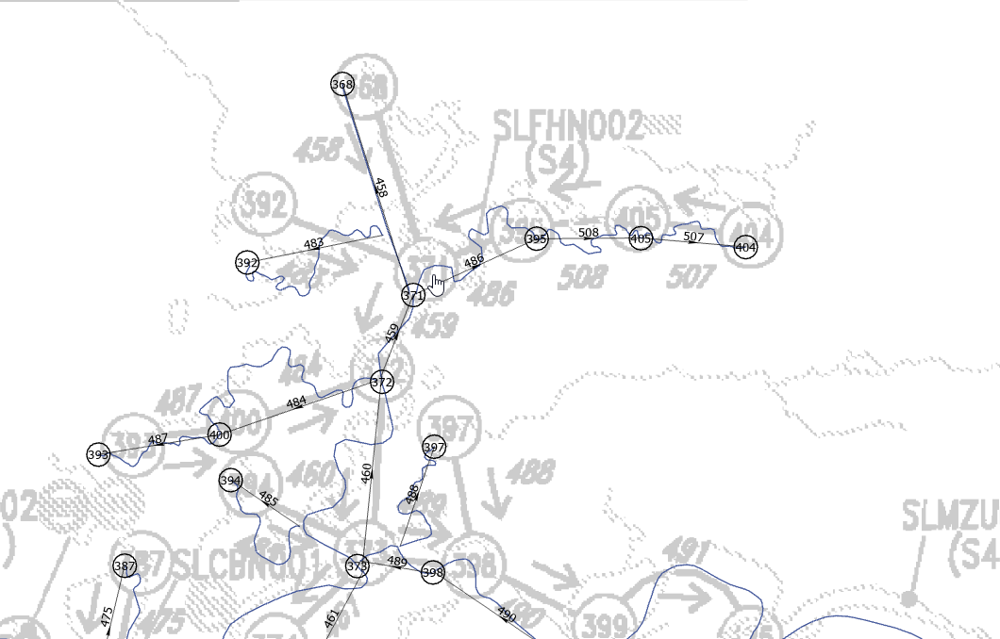

# Creating DSM2 v8.2 GIS Grid Map

## Creating Shapefiles

The existing CSDP network file for the DSM2 8.2 network is incomplete and contains errors. The network file for DSM2 v8.3 is accurate but includes additional channels and nodes that were moved. The easiest way to create shapefiles for the DSM2 v8.2 grid is to modify the network and landmark (nodes) for the 8.3 grid.

## Verification

The goal is to display the PDF grid map as a background image in ArcGIS to verify that all the channel and node numbers are correct and in the correct locations.

1. Use the following command (using Ghostscript in Cygwin) to create a TIFF file from the DSM2 PDF grid map file:
   ```
   gs -q -dNOPAUSE -sDEVICE=tiffg4 -sOutputFile=gridmappdf.tif "DSM2_Grid2.0 (1).pdf" -c quit
   ```
2. Create a copy of the TIFF file with "marsh" in the filename. This is because the PDF grid map has the Suisun Marsh disconnected from the delta and printed in a different scale.
3. Identify a few landmarks that are easily identifiable on both the PDF grid map and the basemap in ArcGIS. Choose three points: one in the north delta, near the confluence, and in the south delta.
4. In QGIS, select `Plugins > Manage and Install Plugins`:
   
5. Search for "GDAL", check the box "Georeferencer GDAL", then click close:
   
6. Select `Raster > Georeferencer`:
   
7. Click the Open Raster button:
   
8. Select the PDF file.
9. Select `Settings > Transformation Settings`:
   
10. Use the following settings, including an output filename:
    
11. Click on a point in the map, and enter UTM coordinates, then click OK:
    
12. When you have specified coordinates for all your points, click the start georeferencing button. A TIFF file will be created, which you can load into ArcGIS:
    
13. In ArcGIS, adjust the layer transparency:
    
14. Now you can easily compare the PDF grid map to the GIS data.

## Attachments

- [image2020-5-12_9-25-2.png](attachments/87228656/87228655.png)
- [image2020-5-12_7-18-51.png](attachments/87228656/87228657.png)
- [image2020-5-12_7-17-47.png](attachments/87228656/87228658.png)
- [image2020-5-12_7-17-15.png](attachments/87228656/87228659.png)
- [image2020-5-12_7-16-53.png](attachments/87228656/87228660.png)
- [image2020-5-12_7-15-45.png](attachments/87228656/87228661.png)
- [image2020-5-12_7-14-51.png](attachments/87228656/87228662.png)
- [image2020-5-12_7-14-8.png](attachments/87228656/87228663.png)
- [image2020-5-12_7-12-43.png](attachments/87228656/87228664.png)
