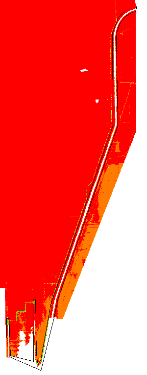

# Extracting Bathymetry Data From an Irregularly Shaped Region

Using the CSDP, create a new centerline using the **Centerline > Create** menu item.

1. Add points to the centerline until it outlines the data you want to extract. The endpoints do not need to be in the same place. A polygon will be created whose vertices are all the centerline points, so the first and last points will be connected.
2. Save the network file.

A Java program called `ExtractShipChannelLeveesFromYoloBypassDEM` can be used to extract the data. This program uses hard-coded filenames for both the input (network file and bathymetry file) and the output (bathymetry file). Eventually, this code will be added to the **Bathymetry** menu in the CSDP.

## Attachments:

 [image2018-12-3_13-53-22.png](attachments/87228843/87228842.png)
(image/png)  
 [image2018-12-3_13-53-12.png](attachments/87228843/87228844.png)
(image/png)  
 [image2018-12-3_13-52-46.png](attachments/87228843/87228845.png)
(image/png)
