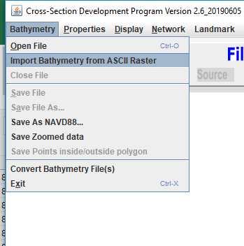
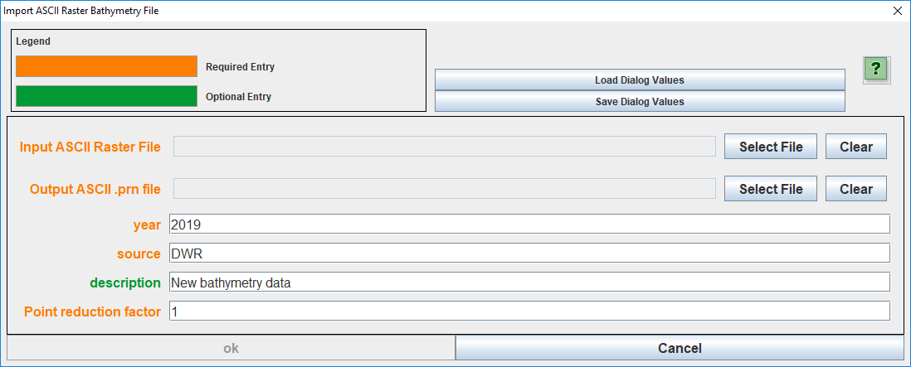

# Importing Digital Elevation Maps (DEMs) into CSDP

## Background

CSDP was developed in the late 1990s and can only consume point features in its custom format. This document outlines the process of converting modern DEMs in raster form into files that CSDP can use.

## CSDP File Format

CSDP supports bathymetry data as point features in XYZ format along with columns for year and source of data. Below is a sample header from a CSDP bathymetry file:

```
;HorizontalDatum:  UTMNAD83
;HorizontalZone:   10
;HorizontalUnits:  Meters
;VerticalDatum:    NAVD88
;VerticalUnits:    USSurveyFeet
;Filetype: bathymetry
;NumElements: 1544252
563970.000000000 4234180.000000000 112.7323 2012 SF_DEM
563990.000000000 4234180.000000000 117.6413 2012 SF_DEM
```

## Steps

1. Use `Arc Toolbox > Conversion Tools > From Raster > Raster to ASCII` to output the DEM as a text file.
   - Ensure the "Output Coordinates" are in NAD83, Zone 10, in meters in UTM projection, and the vertical datum is NAVD88 in meters.
   - Limit the DEM output to the viewable area by setting the "Processing Extent" to "Same as Display."
2. Use the program [ASCIIGridToCSDPConverter](https://github.com/CADWRDeltaModeling/csdp/blob/master/csdp/resources/ASCIIGridToCSDPConverter.exe) to convert the raster ASCII file to a CSDP-compatible format.
3. Open the output file in CSDP.
4. You can also use the CSDP:

    <table class="confluenceTable">
    <tbody>
    <tr class="header">
    <th class="confluenceTh"><div class="content-wrapper">
    <p>Select Bathymetry-Import Bathymetry from ASCII Raster</p>
    <p></p>
    </div></th>
    <th class="confluenceTh"><div class="content-wrapper">
    <p>Fill in the dialog. If dataset is more dense than you need, you can
    enter a factor greater than 1</p>
    <p></p>
    </div></th>
    </tr>
    &#10;</tbody>
    </table>

## Attachments:


