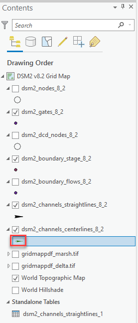
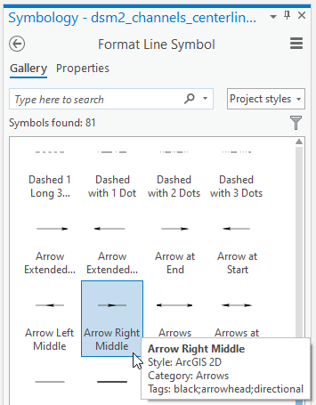

# Symbology

The following symbology is needed:

1.  Arrows on or next to straight line channels and centerline channels.
2.  Nodes displayed as circles with numbers in the middle.
    1.  In ArcGIS Pro, change the symbol to a circle (double click on
        the symbol in the contents pane) and set the circle size to 20
        pt, and the font to Tahoma 8. Select Enable scale-based sizing.
3.  Gates displayed using symbol similar to that used in the pdf grid
    map. Using Meteorology-Fog, Light.

# Channel Arrows

The direction of arrows created using symbology is determined by the
order in which the points are defined in each line. Since the channel
lines (both straight and centerlines) are derived from CSDP data, the
points should always be in order from upstream to downstream.

To modify the symbol:

1.  double-click on the symbol below the layer name (see image below).
   
2.  In the Symbology Panel, under Gallery, select "Arrow Right Middle".
   
3.  Then click on Properties, set the color, and set line width to 15 pt
    (or whatever you want, and select "Enable scale-based sizing".

## Attachments:

[image2020-5-14_15-15-14.png](attachments/87228666/87228665.png)
(image/png)  

[image2020-5-14_15-14-8.png](attachments/87228666/87228667.png)
(image/png)
