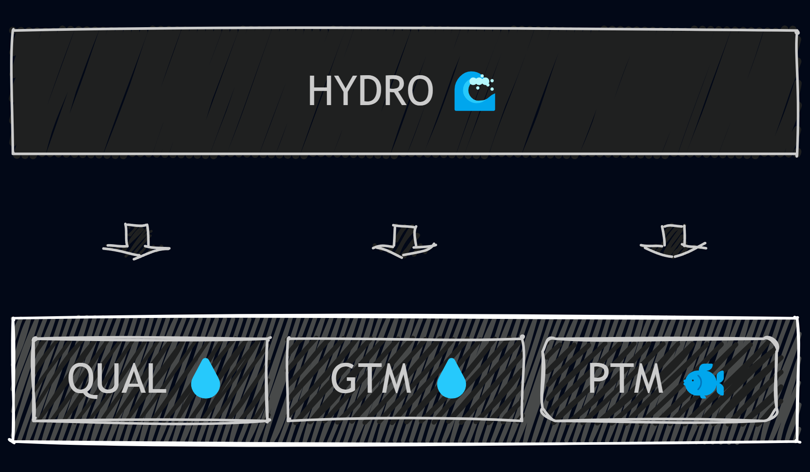

# DSM2 Tutorial Overview

## DSM2 Overview

The Delta Simulation Model II (DSM2) is a one-dimensional mathematical model for dynamic simulation of hydrodynamics, water quality, and particle tracking in a network of riverine or estuarine channels. DSM2 can calculate:

* Stages, flows, and velocities
* Mass transport processes for:
  * **Conservative constituents**:
    * Salts
  * **Non-conservative constituents**:
    * Water temperature
    * Dissolved oxygen
    * Sediment
    * Mercury
* Transport of individual particles

DSM2 provides a powerful simulation package for analyzing complex hydrodynamic, water quality, and ecological conditions in riverine and estuarine systems.

---

## DSM2 Modules

DSM2 currently consists of four modules, as shown in **Figure 1** (Schematic of DSM2 Modules):

- **HYDRO**: Simulates one-dimensional hydrodynamics, including flows, velocities, depth, and water surface elevations. HYDRO provides the flow input for QUAL and PTM.
- **QUAL**: Simulates one-dimensional fate and transport of conservative and non-conservative water quality constituents based on the flow field simulated by HYDRO. This is the older transport model based on BLTM (reference needed) that uses a Lagrangian method with a moving frame of reference.
- **GTM**: Simulates transport of conservative and non-conservative water quality constituents using an Eulerian-Lagrangian method with fixed cells. This is also the base model for sediment and mercury modeling.
- **PTM**: Simulates pseudo-3D transport of neutrally buoyant particles based on the flow field simulated by HYDRO. PTM has multiple applications, ranging from visualization of flow patterns to simulation of discrete organisms such as fish eggs and larvae.

---

## DSM2 Study Types

DSM2 is typically used for three types of Delta simulations: historic conditions, forecasting future conditions (real-time), and planning studies. Each type is described below:

### Recreate Historic Conditions

Historical simulations replicate past operations, hydrologic conditions, water quality, and Delta configurations. These simulations enable calibration and validation of the model by comparing simulation results with field data. Historical simulations also augment available field data to provide a more spatially and temporally complete representation of hydrodynamic and water quality conditions for that time period.

### Forecasting Simulations

Forecasting simulations, also known as real-time simulations, use recent field data and forecast data to project Delta conditions into the near future (typically one to ten weeks). Recently collected historical data provide current conditions for the Delta. Recent tidal elevations at Martinez are used with an astronomical tide forecast to project the Martinez tide into the near future. Corresponding hydrodynamic and water quality conditions in the Delta are then simulated. Forecasting simulations can assist State Water Project operations decisions.

### Planning Studies of Hypothetical Conditions

Delta planning studies evaluate how hypothetical changes to factors such as hydrologic regimes, water quality standards, system operations, and Delta configurations may impact Delta conditions. To explore the impacts of a given scenario under various hydrologic conditions, DSM2 planning studies are typically run under a 16-year sequence of Delta inflows and exports derived from statewide water transfer and storage simulations using CalSim models. More information on CalSim models can be found on the [CalSim website](https://water.ca.gov/Library/Modeling-and-Analysis/Central-Valley-models-and-tools).

Planning simulations can use historical or astronomical tidal data, which incorporate influences of the spring-neap tidal cycle, or simulations can use an average repeating tide (typically the 19-year mean tide). Planning simulations typically assess impacts of proposed changes to Delta operations or configurations, such as modified reservoir releases or dredging of channels. Planning studies may also investigate impacts of hypothesized changes in the natural environment, such as sea level rise.

---

## DSM2 Modes of Operation

### Parameter Descriptions for Three Modes of DSM2 Application

| Simulation Parameter       | Replicate Historic Conditions       | Forecasting Future Conditions       | Planning Studies for Hypothetical Conditions       |
|----------------------------|-------------------------------------|-------------------------------------|----------------------------------------------------|
| **Boundary Tide**          | Historic or astronomical tide       | Historic and projected astronomical forecast tide | Historic, astronomical                              |
| **Input Data**             | Historic inflows and exports Average Delta consumptive use | Recent and current inflows and exports Average Delta consumptive use | CalSim-II statewide operations studies provide inflows and exports Average Delta consumptive use |
| **Simulation Period**      | 1990-present are currently possible | 1-10 weeks into the future          | 1921-2021 sequence from CalSim statewide operations studies |
