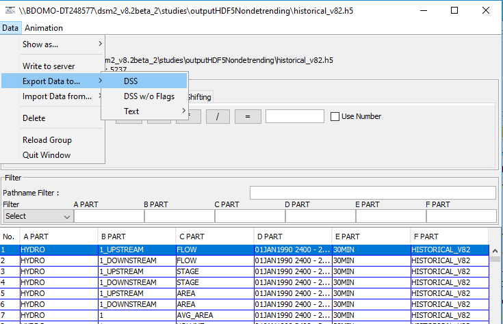

# DSM2 - How to read hdf5 output files

DSM2 writes output in HDF5 format. This format can be read by Vista and
vscript 

## Step-by-step guide

To open a HDF5 file

1.  Open Vista 
2.  Drag and drop or use Session \> Open \> Tidefile from the menu
    options
3.  Select the data items needed and use the  Data \> Export \> Export
    Data To DSS menu item to export the Data to DSS files

<a
href="https://www.youtube.com/watch?v=5PCyxdUC4qw&amp;feature=youtu.be"
rel="nofollow">Video of How to read DSM2 - HDF5 files using VISTA</a>

  

Alternatively here is a snippet of vscript code that does something
similar

**Getting average concentrations from Qual HDF5 file**

``` py
from vtidefile import opentidefile
from vdss import writedss
from vutils import *
import vdisplay
from vdisplay import plot
import sys
import string

def get_avg_conc(tidefile, chan, twstr):
    tf=opentidefile(tidefile)
    if twstr != None:
        print 'Timewindow: %s'%twstr
        tw=timewindow(twstr)
    else:
        tw=None
    refs=tf.find(['','^%s$'%chan,'AVG CONC'])
    if refs and len(refs)==1:
        print "Getting data %s"%(str(chan))
        if tw!=None:
            ref=DataReference.create(refs[0],tw)
        else:
            ref=refs[0]
        return ref.data
    else:
        raise "No data found for %s in file %s"%(chan, tidefile)
if __name__ == '__main__':
    if len(sys.argv) != 2:
        print "Usage: vscript 
    tidefile=sys.argv[1]
    twstr="01JUL2014 0000 - 01AUG2014 0000"
    chans=[291,290,436,435,434,433]
    chan_concs=[]
    for chan in chans:
        chan_concs.append(get_avg_conc(tidefile, chan, twstr))
        
    for conc in chan_concs:
        plot(conc)
```

  

DSM2-vista also supports export data to hec-dss format (One or multiple
timeseries path could be selected) See the following menu option as
example. 



