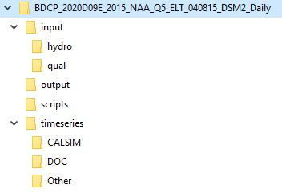
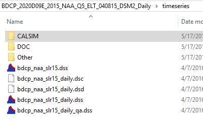

# Scripts and input files

# Folder Structure

Most preprocess scripts are originally located at ${DSM2}/scripts/,
while it also needs DSM2 config file and input timeseries (from CalSIM)
to run.

Fig. Sample batch preprocess from CalSIM II to DSM2

Some key functions are explained below:

-   config file usually defines the time window, CALSIMNAME,
    DSM2MODIFIER, which need to be consistent with the scripts and
    timeseries files.
-   planning_boundary_flow contains method 'smooth_flow' to 'tension
    spline' boundaries Sac and Vernalis from monthly to daily-interval
    data.
-   DICU are directly transferred as monthly-interval data.
-   prep_ec generate Martinez EC from its astro-planning stage and NDO
    (modified from G-model and has a newly calibrated version). Refer to
    [Martinez EC
    Generator](http://msb-confluence/display/DM/Martinez+EC+Generator) for
    its introduction and updates.

# To run

type prepro\*.bat config\*.inp at the scenario path in command window

\*usually we start preprocess earlier (like 1 month) than hydro + qual

  

# CWF preprocess version in DSM2 v806

CH2M helped creating an updated version for project 'California Water
Fix' (CWF), whose existing condition (EST)  and No Action Alternative
(NAA) are widely used as templates for DSM2 planning study.

  

|  |  |  |
|:---:|:---:|:---:|
| Directory Structure | Timeseries Files | CalSim Files |

Figure. Sample directory of CWF scenario for DSM2 planning modeling

  

Compared to the original scripts package, CWF version has

-   a sub-folder 'scripts' under scenario. It contains updated scripts
    to replace those under ${DSM2}/scripts/.
-   a sub-folder 'input' under scenario. It contains updated hydro and
    qual grids.
-   a sub-folder 'timeseries' under scenario. It contains updated DSM2
    input files (\*daily.dss for boundaries, \*.dss for Martinez stage,
    DICU, oprule, QUAL, \*qa.dss for QAQC)
-   the above input files are generated from its 'CALSIM' subfolder,
    with \*DV.dss (CalSIM outputs) and \*SV.dss (CalSIM inputs) required
    by the current CalSIM II preprocess (CalSIM 3 plans to keep only
    \*DV.dss)

  

Figure. CWF version's batch preprocess from CalSIM II to DSM2

More details in the scripts:

-   planning_boundary_flow contains method 'smooth_flow' to 'tension
    spline' boundaries Sac and Vernalis from monthly to daily-interval
    data.
-   CWF dailymapping processes all boundaries and source flows to
    daily-interval data.
-   prep_ec has updated changes with sea level rise adjustment
-   Vernalis Adaptive Management Plan (VAMP) of the original scripts is
    not active anymore
-   Source flows and intakes are added/modified
-   Method 'daily mapping' to process all boundaries/source inputs to
    daily-interval data

  

  

  

  

  

## Attachments:

- [bat_prep_cwf.png](../attachments/87228611/87228612.png) (image/png)
- [CWFtimeseries.JPG](../attachments/87228611/87228613.jpg) (image/jpeg)
- [CWFcalsimfiles.JPG](../attachments/87228611/87228614.jpg) (image/jpeg)
- [CWFdir.JPG](../attachments/87228611/87228615.jpg) (image/jpeg)
- [bat_prep.png](../attachments/87228611/87228616.png) (image/png)
- [prep_doc_bst.py](../attachments/87228611/87228617.py) (application/octet-stream)
- [planning_ec_mtz_bst.py](../attachments/87228611/87228618.py) (application/octet-stream)
- [planning_boundary_flow_bst.py](../attachments/87228611/87228619.py) (application/octet-stream)
- [extend_calsim_outputs_bst.py](../attachments/87228611/87228620.py) (application/octet-stream)
- [expand_seasonal_bst.py](../attachments/87228611/87228621.py) (application/octet-stream)
- [dailymapping_051010.py](../attachments/87228611/87228622.py) (application/octet-stream)
- [prep_ec_bst.py](../attachments/87228611/87228623.py) (application/octet-stream)
- [prepro_BST_Existing.bat](../attachments/87228611/87228624.bat) (application/octet-stream)
