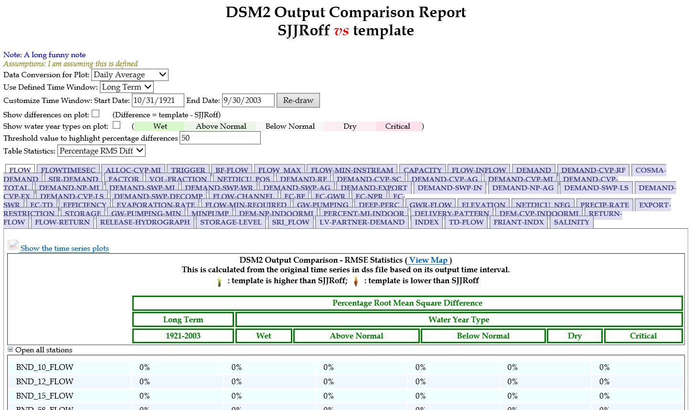

# Supporting Tools and QA/QC

All preprocess scripts are written with DSM2-[Vista](http://msb-confluence/display/DM/Vista). Use the most updated version available at [DSM2 Vista GitHub](https://github.com/CADWRDeltaModeling/dsm2-vista). Ensure relevant environment variables are updated.

### Recommended Practices

1. **Review and Compare CALSIM Outputs**
   - Use [HEC-DSS](http://msb-confluence/display/DM/HEC+Manuals) and DSM2-[Vista](http://msb-confluence/display/DM/Vista).
   - Ensure consistency in pathnames, time windows, etc., between comparison scenarios.

2. **WRIMS Report Tool**
   - Useful for comparing CALSIM outputs (e.g., DSM2 inputs in `timeseries\CALSIM\\DV.dss`).
   - [WRIMS Tool Details](https://www.water.ca.gov/Library/Modeling-and-Analysis/Modeling-Platforms/Water-Resource-Integrated-Modeling-System).

3. **Compare DSS Tool**
   - Use the [Compare DSS Tool](http://msb-confluence/display/DM/Compare+DSS+Tool) in DSM2-[Vista](http://msb-confluence/display/DM/Vista).
   - Scripts: `${vista}\bin\compare_dss.bat` or `${vista}\bin\compare_dss_files.bat`.

\* One good practice is to locate changes first (maybe the big ones), then use compare_dss.bat to specify and illustrate them.

4. **Net Delta Flow (NDO) Check**
   - Compare NDO = inflows - outflows - CU for accuracy.

### Attachments

- [compareDSSfiles.JPG](attachments/SupportingTools5.jpg)
- [compareDSS.JPG](attachments/SupportingTools4.jpg)
- [wrimsReport2.JPG](attachments/SupportingTools3.jpg)
- [wrimsReport1.JPG](attachments/SupportingTools2.jpg)
- [wrimsReport.png](attachments/SupportingTools1.png)
