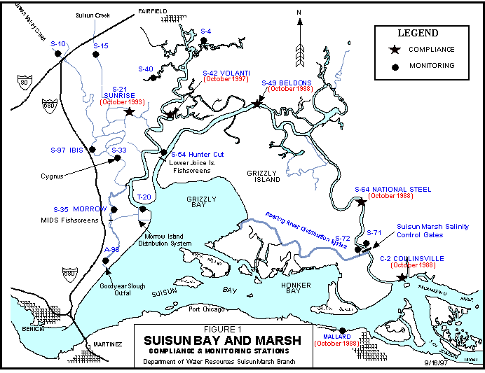

# DSM2 Bay-Delta Tutorial 5: Suisun Marsh Operating Rules

## Purpose: ***The objective of this tutorial is to learn about the Suisun Marsh Salinity Control Gate and practice tuning an operating rule.***

## Background:

## ***The Suisun Marsh Salinity Control Gates (SMSCG) were completed and began operating in October 1988.*** ***The first year of operation was used to test the gates, and official operation began in November 1989. The*** ***facility consists of a boat lock, a series of three radial gates, and flashboards. The SMSCG control salinity*** ***by restricting the flow of higher salinity water from Grizzly*** ***Bay into Montezuma Slough during incoming*** ***tides and retaining lower salinity Sacramento River water from the previous ebb tide. Operation of the*** ***SMSCG in this fashion lowers salinity in Suisun Marsh channels and results in a net movement of water*** ***from east to west. When Delta outflow is low to moderate and the SMSCG are not operating, net movement*** ***of water is from west to east, resulting in higher salinity water in Montezuma Slough.***

## ***The SMSCG usually begin operating in early October and, depending on salinity conditions, may continue*** ***operating through the end of the control season in May. When the channel water salinity decreases sufficiently*** ***below the salinity standards, or at the end of the control season, the flashboards are removed and*** ***the SMSCG raised to allow unrestricted movement through Montezuma Slough. Details of annual SMSCG*** ***operations can be found in Summary of Salinity Conditions in Suisun Marsh During Water Years 1984–1992 (DWR 1994b), or the Suisun Marsh Monitoring Program Data Summary produced annually by*** ***DWR's Environmental Services Office.***

## ***The tidal operation of the gate should open the gate when a water level drop of 0.3 ft exists across the gate (upstream to downstream) and to close the gate when velocity is less than 0.1 (impending flood tide). The boat lock is held open whenever the radial gates are operated tidally. The flashboard is typically in place when the gates are operated and removed when the gate is fully open. Note that in the historical record these relationships do not always hold – there have been numerous operating experiments.***

## ***We will use Martinez EC as a surrogate to determine when EC compliance is an issue and the gates need to be operated tidally.***

## ***A simplified version of the Marsh standards is given below. The units are millisiemens per square cm, which are a thousand times the microsiemens used in DSM2 modeling. There is a water year dependence in the full set of standards – the levels given in the table apply to 1974-1976 but not to 1977 which is a "deficiency year". In this tutorial, we will consider only the site S-42, Suisun Slough @ Volanti Slough. The RKI for this location is SLSUS012, and the location is channel 494 distance 4681ft.***

  
  

<table class="wrapped confluenceTable">
<colgroup>
<col style="width: 11%" />
<col style="width: 11%" />
<col style="width: 11%" />
<col style="width: 11%" />
<col style="width: 11%" />
<col style="width: 11%" />
<col style="width: 11%" />
<col style="width: 11%" />
<col style="width: 11%" />
</colgroup>
<tbody>
<tr class="odd">
<td class="confluenceTd">

 

</td>
<td class="confluenceTd">
 

</td>
<td class="confluenceTd">
 

</td>
<td class="confluenceTd">
<strong>D-1641 STANDARD</strong>
</td>
<td class="confluenceTd">
 

</td>
<td class="confluenceTd">
 

</td>
<td class="confluenceTd">
 

</td>
<td class="confluenceTd">
 

</td>
<td class="confluenceTd">
 

</td>
</tr>
<tr class="even">
<td class="confluenceTd">
 

</td>
<td class="confluenceTd">
OCT
</td>
<td class="confluenceTd">
NOV
</td>
<td class="confluenceTd">
DEC
</td>
<td class="confluenceTd">
JAN
</td>
<td class="confluenceTd">
FEB-MAR
</td>
<td class="confluenceTd">
APR-MAY
</td>
<td class="confluenceTd">
 

</td>
<td class="confluenceTd">
 

</td>
</tr>
<tr class="odd">
<td class="confluenceTd">
<em>Eastern</em>
</td>
<td class="confluenceTd">
 

</td>
<td class="confluenceTd">
 

</td>
<td class="confluenceTd">
 

</td>
<td class="confluenceTd">
 

</td>
<td class="confluenceTd">
 

</td>
<td class="confluenceTd">
 

</td>
<td class="confluenceTd">
 

</td>
<td class="confluenceTd">
 

</td>
</tr>
<tr class="even">
<td class="confluenceTd">
<strong>C-2</strong>
</td>
<td class="confluenceTd">
19.0
</td>
<td class="confluenceTd">
15.5
</td>
<td class="confluenceTd">
15.5
</td>
<td class="confluenceTd">
12.5
</td>
<td class="confluenceTd">
8.0
</td>
<td class="confluenceTd">
11.0
</td>
<td class="confluenceTd">
 

</td>
<td class="confluenceTd">
 

</td>
</tr>
<tr class="odd">
<td class="confluenceTd">
<strong>S-64</strong>
</td>
<td class="confluenceTd">
19.0
</td>
<td class="confluenceTd">
15.5
</td>
<td class="confluenceTd">
15.5
</td>
<td class="confluenceTd">
12.5
</td>
<td class="confluenceTd">
8.0
</td>
<td class="confluenceTd">
11.0
</td>
<td class="confluenceTd">
 

</td>
<td class="confluenceTd">
 

</td>
</tr>
<tr class="even">
<td class="confluenceTd">
<strong>S-49</strong>
</td>
<td class="confluenceTd">
19.0
</td>
<td class="confluenceTd">
15.5
</td>
<td class="confluenceTd">
15.5
</td>
<td class="confluenceTd">
12.5
</td>
<td class="confluenceTd">
8.0
</td>
<td class="confluenceTd">
11.0
</td>
<td class="confluenceTd">
 

</td>
<td class="confluenceTd">
 

</td>
</tr>
<tr class="odd">
<td class="confluenceTd">
<em>Western</em>
</td>
<td class="confluenceTd">
 

</td>
<td class="confluenceTd">
 

</td>
<td class="confluenceTd">
 

</td>
<td class="confluenceTd">
 

</td>
<td class="confluenceTd">
 

</td>
<td class="confluenceTd">
 

</td>
<td class="confluenceTd">
 

</td>
<td class="confluenceTd">
 

</td>
</tr>
<tr class="even">
<td class="confluenceTd">
<strong>S-42</strong>
</td>
<td class="confluenceTd">
19.0
</td>
<td class="confluenceTd">
16.5
</td>
<td class="confluenceTd">
15.5
</td>
<td class="confluenceTd">
12.5
</td>
<td class="confluenceTd">
8.0
</td>
<td class="confluenceTd">
11.0
</td>
<td class="confluenceTd">
 

</td>
<td class="confluenceTd">
 

</td>
</tr>
<tr class="odd">
<td class="confluenceTd">
<strong>S-21</strong>
</td>
<td class="confluenceTd">
19.0
</td>
<td class="confluenceTd">
16.5
</td>
<td class="confluenceTd">
15.5
</td>
<td class="confluenceTd">
12.5
</td>
<td class="confluenceTd">
8.0
</td>
<td class="confluenceTd">
11.0
</td>
<td class="confluenceTd">
 

</td>
<td class="confluenceTd">
 

</td>
</tr>
<tr class="even">
<td class="confluenceTd">
<strong>S-35</strong>
</td>
<td class="confluenceTd">
N/A*
</td>
<td class="confluenceTd">
N/A*
</td>
<td class="confluenceTd">
N/A*
</td>
<td class="confluenceTd">
N/A*
</td>
<td class="confluenceTd">
N/A*
</td>
<td class="confluenceTd">
N/A*
</td>
<td class="confluenceTd">
 

</td>
<td class="confluenceTd">
 

</td>
</tr>
<tr class="odd">
<td class="confluenceTd">
<strong>S-97</strong>
</td>
<td class="confluenceTd">
N/A*
</td>
<td class="confluenceTd">
N/A*
</td>
<td class="confluenceTd">
N/A*
</td>
<td class="confluenceTd">
N/A*
</td>
<td class="confluenceTd">
N/A*
</td>
<td class="confluenceTd">
N/A*
</td>
<td class="confluenceTd">
 

</td>
<td class="confluenceTd">
 

</td>
</tr>
<tr class="even">
<td class="confluenceTd">
 

</td>
<td class="confluenceTd">
 

</td>
<td class="confluenceTd">
 

</td>
<td class="confluenceTd">
 

</td>
<td class="confluenceTd">
 

</td>
<td class="confluenceTd">
 

</td>
<td class="confluenceTd">
 

</td>
<td class="confluenceTd">
 

</td>
<td class="confluenceTd">
 

</td>
</tr>
<tr class="odd">
<td class="confluenceTd">
*In a good faith effort, DWR will 
consider S35 and S97 
monitoring stations
</td>
<td class="confluenceTd">
*In a good faith effort, DWR will consider
S35 and S97 monitoring stations
</td>
<td class="confluenceTd">
 

</td>
<td class="confluenceTd">
 

</td>
<td class="confluenceTd">
 

</td>
<td class="confluenceTd">
 

</td>
<td class="confluenceTd">
 

</td>
<td class="confluenceTd">
 

</td>
<td></td>
</tr>
<tr class="even">
<td class="confluenceTd">
when deciding gate operations.
</td>
<td class="confluenceTd">
when deciding gate operations.
</td>
<td class="confluenceTd">
 

</td>
<td class="confluenceTd">
 

</td>
<td class="confluenceTd">
 

</td>
<td class="confluenceTd">
 

</td>
<td class="confluenceTd">
 

</td>
<td class="confluenceTd">
 

</td>
<td class="confluenceTd">
 

</td>
</tr>
</tbody>
</table>

  
  

## Steps:

  

1.  **Copy the study and configuration files:**
    1.  In windows, navigate to
        *\\{DSM2_home}\study_templates\ocap_sdip*.
    2.  Copy the planning study to the *\\{DSM2_home}\tutorials*
        directory.
    3.  Rename *config_sdip_ocap_71.inp* as config_suisun.inp.
    4.  In the configuration file, make sure the study dates cover the
        full 1974-1991 period for planning runs. It is usually a good
        idea to preprocess the full period of the inputs, even if you
        are going to do run dsm2 on a subset of the simulation period.
    5.  Set DSM2MODIFIER to suisun.
    6.  Run prepro on the file config_suisun.inp:

\> prepro config_suisun.inp

1.  **Examine and correct the Suisun Marsh operating rule.**

The Montezuma Slough velocity close rule in
*oprule_montezuma_planning_gate.inp* is based on flow (note this file
name will have a version date appended to it. The rule requires
correction to be based on velocity.

1.  1.  Add a file representing a "correction layer" to the operating
        rules called oprule_revised_montezuma.inp.
    2.  Correct the *velclose* part of the rule to be based on channel
        velocity. You can look up the correct variable name in the
        Operating Rule Guide in the html help system.
    3.  Note the Martinez EC path used in the operating rule to
        determine whether the gate needs to be operated tidally. Open
        the suisun.dss input file and tidally or daily average this
        path. Then substitute the tidally averaged version of EC in the
        operating rule by overriding the time series definition in the
        Operation Time Series table.
    4.  Note that the threshold for operating the gate is in the
        configuration file: MSCS_EC_THRESH 20000

  

1.  **Run DSM2:**
    1.  In the configuration file, set the run dates to 1974 – 1977.
    2.  Add the output you will need to examine the S42 site using the
        information given in the introduction and the techniques you
        have learned from the other tutorials.
    3.  Point the CONFIGURATION include file in *hydro.inp* to
        *config_suisun.inp*.

d\. Launch HYDRO with the command:  
\>hydro hydro.inp

1.  **Examine the output.**
    1.  Compare EC output to the standard presented in the introduction.
        Is the gate over operating or underoperating?
    2.  How can you further enhance the operating rule? Discuss the
        boatlock and flashboards.
