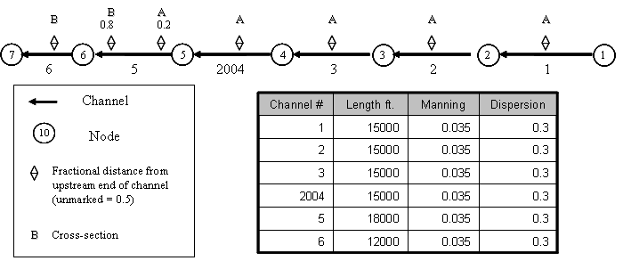

# Tutorial 1: Channels

**Task**  
Run DSM2 for a steady boundary condition flow and salinity (EC-electrical conductivity) simulation for a simple straight channel grid.  

**Skills Gained**

- Get started with DSM2
- Creating channels
- Establishing initial and boundary conditions  

The purpose of this tutorial is twofold: to get a start with the DSM2 model and to get practice setting up channels. We will set up a simple channel-only grid with simple constant boundary conditions and run both HYDRO and QUAL. We will look at two formats for entering cross-section geometry (the new DSM2 single file format and CSDP [Cross Section Development Program] format) and familiarize ourselves with the *echo* output file that gives you a single-file complete record of all the input data used in a DSM2 module.  

For the tutorial, the channels have the following configuration and specifications:  

  

**Figure 1 - Simple channel configuration and specifications.**  

Note that there are two cross-section geometries labeled A and B, which will be specified later in this tutorial. In all the channels except Channel 5, the cross-sections have been assigned at the midpoint of the channel. In Channel 5, the cross-sections are assigned at fractions 0.2 and 0.8 of the length of the channel measured from the upstream end. The [DSM2 grid map](https://data.cnra.ca.gov/dataset/dsm2) includes arrows pointing from upstream to downstream, indicating the positive direction of flow.

---

### Overview of DSM2 Channel Cross Sections

DSM2 assumes a piecewise linear cross-sectional bathymetry. Width, area, and wetted perimeter are tabulated according to elevation. Each elevation lists the data (width) or cumulative data (wetted perimeter and area) below the given elevation. Anything above the top elevation is extrapolated using a slope given by a global scalar called *levee_slope*.  

  
**Figure 2: Piecewise linear bathymetry**

For instance, for a cross-section halfway downstream in a fictitious channel 123, the five layers of a cross-section with elevations given by Figure 2 might be tabulated as follows:

```
XSECT_LAYER
CHAN_NO DIST ELEV AREA WIDTH WET_PERIM
123 0.5 -14.6 0.0 0.0 0.0
123 0.5 -9.2 216.0 80.0 102.5
123 0.5 -4.0 736.0 120.0 111.0
123 0.5 9.5 2410.0 160.0 142.3
123 0.5 12.0 3028.5 162.0 148.0
```

The above table is in the single-file DSM2 cross-section format. An analogous table is produced by the Cross Section Development Program (CSDP). We will practice using both in the tutorial. The parameter *levee_slope* is seldom changed from its standard value of 0.33.

---

The following steps will instruct you on how to create the channels, give them very simple boundary conditions, and run the model.

1.  **Open the hydro input file and add parameters:**
    1.  Use a text editor like Notepad++, Textpad, or Emacs.
    2.  Navigate to the `${DSM2_home}\tutorial\simple\t1_channels` directory.
    3.  Open the `hydro.inp` file.

2.  **In HYDRO, add the Scalar Runtime information:**
    1.  Locate the `SCALAR` table in `hydro.inp`.
    2.  Add the following scalars:
        
            
            SCALAR
            NAME VALUE
            run_start_date 01JAN1992
            run_end_date 01MAR1992
            run_start_time 0000
            run_end_time 0000
            temp_dir c:/temp
            title "TUTORIAL SIMULATION ${DSM2MODIFIER}"
            warn_unchecked false
            END
            
        
    3.  Ensure `temp_dir` points to a location with ample disk space.


3.  **In HYDRO, add Channel information:**
    -  Add a `CHANNEL` table with channel details.
    -  Add an `XSECT_LAYER` table for cross-section geometry.

    Example for Channel 1:
```
CHANNEL
CHAN_NO LENGTH MANNING DISPERSION UPNODE DOWNNODE
1 10000 0.035 10 1 2
END

XSECT_LAYER
CHAN_NO DIST ELEV AREA WIDTH WET_PERIM
1 0.5 -24.0 0.0 40.0 40.0
1 0.5 0.0 960.0 80.0 102.5
1 0.5 20.0 2640.0 160.0 192.0
END
```
   Repeat for other channels as needed.

4. **In HYDRO, set the Boundary information:**
   - Add `BOUNDARY_FLOW` and `BOUNDARY_STAGE` tables for upstream and downstream boundaries.

   Example:

   ```
   BOUNDARY_FLOW
   NAME NODE SIGN FILLIN FILE PATH
   upstream_flow 1 1 last constant 200.
   END

   BOUNDARY_STAGE
   NAME NODE FILLIN FILE PATH
   downstream_stage 7 last constant 0.0
   END
   ```

5. **In HYDRO, set the Initial Conditions:**
   - Add a `CHANNEL_IC` table to set initial stage and flow for each channel.

   Example:

   ```
   CHANNEL_IC
   CHAN_NO DISTANCE STAGE FLOW
   1 0 0.0 0.0
   1 length 0.0 0.0
   END
   ```

6. **In HYDRO, specify the Output Locations:**
   - Add an `OUTPUT_CHANNEL` table to request output data.

   Example:

   ```
   OUTPUT_CHANNEL
   NAME CHAN_NO DISTANCE VARIABLE INTERVAL PERIOD_OP FILE
   bnd_1 1 0 flow 15min inst output.dss
   END
   ```

7. **In QUAL, add the Scalar Runtime information:**
   - Add runtime scalars to `qual.inp`.

   Example:

   ```
   SCALAR
   NAME VALUE
   run_start_date 02JAN1992
   run_end_date 01MAR1992
   run_start_time 0000
   run_end_time 0000
   temp_dir c:/temp
   END
   ```

8. **In QUAL, set the Boundary Concentration information:**
   - Add a `NODE_CONCENTRATION` table for upstream and downstream boundaries.

   Example:

   ```
   NODE_CONCENTRATION
   NAME NODE_NO VARIABLE FILLIN FILE PATH
   upstream_flow 1 ec last constant 200.
   downstream_stage 7 ec last constant 30000.
   END
   ```

9. **In QUAL, specify Output Locations:**
   - Add an `OUTPUT_CHANNEL` table for concentration data.

   Example:

   ```
   OUTPUT_CHANNEL
   NAME CHAN_NO DISTANCE VARIABLE INTERVAL PERIOD_OP FILE
   bnd_1 1 0 ec 15min inst ${QUALOUTDSSFILE}
   END
   ```

10. **Run HYDRO and QUAL:**
    - Run `hydro hydro.inp` and `qual qual.inp` from the command line.
    - Verify the output in `output.dss`.

11. **CSDP style cross-sections:**
    - Use `hydro_csdp.inp` to reference external cross-section files.

    Example:

    ```
    XSECT
    CHAN_NO DIST FILE
    1 0.5 xsect_a.txt
    END
    ```

12. **Rerun HYDRO and compare cross-section formats.**

13. **Run HYDRO using echoed input.**

---

**Brain Teasers**
1. What is the actual delta-x between computational points for each of the subreaches (channels 1-6)?
2. Why is the requested dx the minimum spatial step for each reach? Wouldn't you want to impose a maximum on how big dx can be?
3. Change the bottom elevation of one of the cross-sections by lowering it 5ft. How does this affect the simulation?

