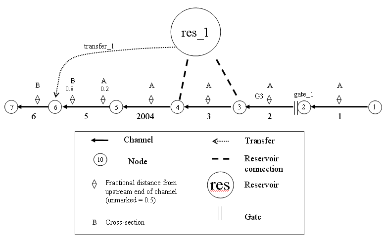

# Tutorial 6: Operating Rules

## Task

- Operate a gate based on stage criteria.
- Regulate a source/sink inflow.

## Skills Gained

Learn how to use Operating Rule Language (ORL) statements to set gate operations and flows dynamically.

The purpose of this tutorial is to practice using ORL statements to set gate operations and flows dynamically. For example, a gate can automatically close when stage conditions reach a threshold. In this tutorial, we will create operating rules to operate a gate and regulate a source/sink inflow.

Extensive documentation on DSM2 operating rules can be found in the DSM2 documentation under the START menu.

**Figure 1:** **Simple channel network with a reservoir, gate, flow transfer, and dummy reservoir.**

### Adding a Second Gate Where Op Rule Will Be Applied

1. Navigate to the directory: `{DSM2_home}\tutorial\simple\t6_oprule`.
2. Create a file `grid_tutorial_opitems.inp`.
3. Open `grid_tutorial_base.inp` and copy the GATE table with `gate_1`. Paste it into `grid_tutorial_opitems.inp` and make the following changes:
   - **NAME**: `gate_2`
   - **TO_NODE**: 5

### Adding Output for the Second Gate

1. Create a file called `output_oprule_tutorial.inp`.
2. Create the OUTPUT_GATE table:

```text
OUTPUT_GATE
NAME GATE_NAME DEVICE VARIABLE INTERVAL PERIOD_OP FILE
END
```

3. In the output table, enter the following values into the appropriate fields:
   - **Output Name**: `gate_2_weirop`
   - **Gate Name**: `gate_2`
   - **Device**: `weir`
   - **Variable**: `op-from-node`
   - **Time Interval**: `15min`
   - **Period Op**: `inst`
   - **File**: `${HYDROOUTDSSFILE}`

4. Add the following channel outputs in a new OUTPUT_CHANNEL table:

```text
OUTPUT_CHANNEL
NAME CHAN_NO DISTANCE VARIABLE INTERVAL PERIOD_OP FILE
trigger_loc 4 7500 stage 15min inst ${HYDROOUTDSSFILE}
ds_gate2 5 0 flow 15min inst ${HYDROOUTDSSFILE}
END
```

5. Add the output layer to the list of include files in `hydro.inp` and save your work.

### Create an Operating Rule to Close the Weir when Stage is Low

1. Create a file called `oprule_tutorial.inp`.
2. Create the `Operating Rules` table:

```text
OPERATING_RULE
NAME ACTION TRIGGER
END
```

3. Enter the following values into the appropriate fields:
   - **Name**: `weir_close`
   - **Action Definition**: `"SET gate_op(gate=gate_2, device=weir, direction=from_node) TO CLOSE RAMP 30MIN"`
   - **Trigger Definition**: `"stage_critical AND op_applies"`

4. Create an OPERATION include block in `hydro.inp` and add the new file so that it will be used by DSM2-HYDRO:

```text
OPERATION
oprule_tutorial.inp
END
```

5. Save the current settings.

Note that the expressions `stage_critical` and `op_applies` will be created in a later step.

### Create an Operating Rule to Open the Weir when Stage is High

As before, we will enter the rule to open the weir first in terms of the expressions `stage_relax` (a condition where stage is safely above a threshold where we can open the gate) and `op_applies`. In the next step, we will define these expressions.

1. In the `Operating Rules` table, enter the following values into the appropriate fields:
   - **Name**: `weir_open`
   - **Action Definition**: `"SET gate_op(gate=gate_2, device=weir, direction=from_node) TO OPEN RAMP 30MIN"`
   - **Trigger Definition**: `"(stage_relax AND op_applies) OR NOT(op_applies)"`

2. Save the current settings.

3. In the `hydro.inp` file, add the following environmental variables and values into the ENVVAR section:

```text
STAGE_CRITICAL 1.4
STAGE_RELAX 1.6
```

### Define Expressions used in the rule

1. In the file `oprule_tutorial.inp`, create the `OPRULE_EXPRESSION` table:

```text
OPRULE_EXPRESSION
NAME DEFINITION
END
```

2. Enter the following values into the appropriate fields:
   - **Name**: `op_applies`
   - **Definition**: `"SEASON < 01FEB"`

3. Enter the following values into the appropriate fields. Don't forget quotes!!
   - **Name**: `stage_critical`
   - **Definition**: `"chan_stage(channel=4, dist=7500) < ${STAGE_CRITICAL}"`

4. Enter the following values into the appropriate fields:
   - **Name**: `stage_relax`
   - **Definition**: `"chan_stage(channel=4, dist=7500) > ${STAGE_RELAX}"`

5. Save the current settings.

6. Now run HYDRO and QUAL:
   - Open a command window for the `t6_oprule` directory.
   - In the command window, type: `hydro hydro.inp`.
   - In the command window, type: `qual qual.inp`.
   - Open the `output.dss` file in the `t6_oprule` directory, and examine the results.

### Add a Reduced Flow Operating Rule

In our next operating rule, we will control the inflow to a node by having it toggle back and forth between a larger "full flow" and a "reduced flow". First, we will enter the rule and then we will define the full and reduced flows.

1. In the `Operating Rules` table, enter the following values into the appropriate fields:
   - **Name**: `flow_reduce`
   - **Action Definition**: `SET ext_flow(name=source1) TO ifelse(stage_critical,reduced_flow,full_flow)`
   - **Trigger Definition**: `TRUE`

2. Now create the expressions that define `full_flow` and `reduced_flow`. In the `Oprule Expressions` table:
   - Enter the following values into the appropriate fields that define `full_flow`. This will involve the time series `source_flow` which we will enter later:
     - **Input Name**: `full_flow`
     - **Definition**: `ts(name=source_flow) [note: this is a reference to a time series we haven't defined yet].`

3. Do the same for `reduced_flow`. Note: we are defining `reduced_flow` in terms of the time series. There is no guarantee of what order expressions will be evaluated, so you cannot safely define `reduced_flow` in terms of another expression such as `full_flow`. Enter the following values into the appropriate fields:
   - **Input Name**: `reduced_flow`
   - **Definition**: `0.5*ts(name=source_flow).`

4. Save the current settings.

5. Now we will define the `source_flow` time series upon which the `full_flow` and `reduced_flow` expressions are based.
6. Create the `Operation Time Series` table:

```text
OPRULE_TIME_SERIES
NAME FILLIN FILE PATH
```

7. Enter the following values into the appropriate fields:
   - **Input Name**: `source_flow`
   - **Input File**: `${TUTORIALINPUT}`
   - **Path**: `/TUTORIAL/SOURCE/FLOW//15MIN/CONSTANT/ [Note: there are two forward slashes between FLOW and 15MIN]`
   - **Fillin**: `none`

8. Save the current settings.

### Override the Expression op_applies

Recall that `op_applies` is used to determine when the weir is operated. Previously the definition of this expression was seasonal: the expression was `SEASON < 01FEB`. The goal now is to make the same expression depend on a time series. Rather than change the expression, we will override it in a new layer.

1. Add a new Operating Rules Layer:
   - Create a file called `oprule_tutorial_revision.inp`

2. Redefine the expressions that define `op_applies`. In the `Expressions` table:
   - Create the `OPRULE_EXPRESSION` table.
   - Enter the following values into the appropriate fields:
     - **Input Name**: `op_applies`
     - **Definition**: `"ts(name=op_used)>0.0" [note: this is a reference to a time series we will define in the next step].`

3. Define the time series `op_used` on which the `op_applies` expression depends. In the `Operation Time Series` table:
   - Right-click and select `Insert row`.
   - Enter the following values into the appropriate fields:
     - **Input Name**: `op_used`
     - **Input File**: `${TUTORIALINPUT}`
     - **Path**: `/TUTORIAL/GATE/FLAP_OP//IR-YEAR/TIMEVAR/`
     - **Fillin**: `none`

4. Add `oprule_tutorial_revision.inp` after `oprule_tutorial.inp` in the OPERATIONS block of `hydro.inp` so that it will be used by HYDRO.
5. Run HYDRO and QUAL and examine the results.

## Attachments

- 
- 
