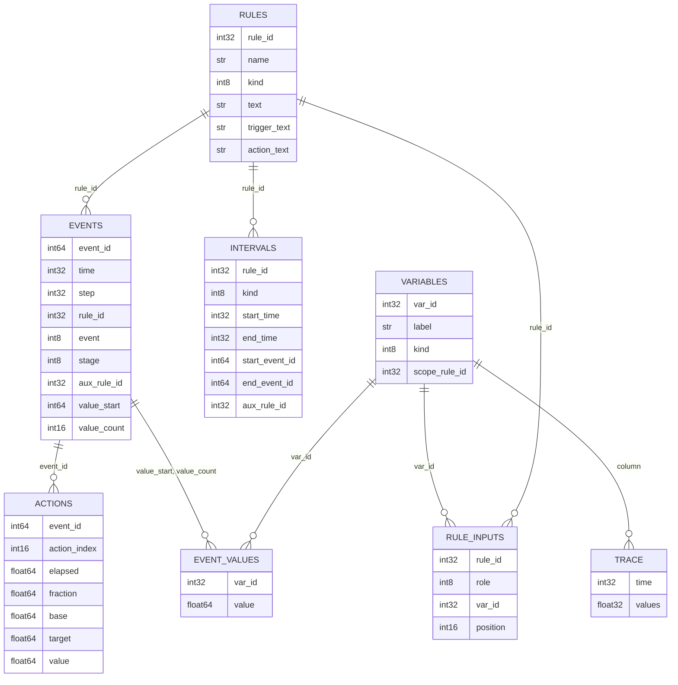
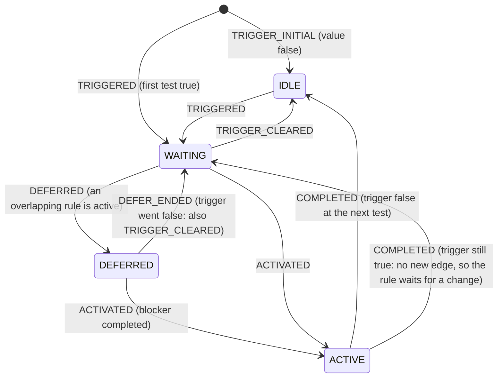

# oprule log in HDF5: plan

Status: **implemented** (2026-10-01). Sections 0 to 10 are the plan; section 11 records what was built and where it differs. Original text: plan written 2026-09-30, revised 2026-10-01. This document records the design thinking; the text log it extends is described in [OPRULE_REFERENCE.md](OPRULE_REFERENCE.md) B10.

## 0. Decisions of 2026-10-01 (they override the older text below where they differ)

| # | Decision |
|---|---|
| 1 | A rule is a trigger plus an action. The action starts only when the trigger changes from false to true; true to false does nothing by itself. It can be deferred by an active rule, or missed if the trigger falls first. |
| 2 | The log records only significant transitions: the trigger change with the inputs that caused it, and the action taken. |
| 3 | The text writer is dropped (provisional, until the HDF5 writer replaces it). Tests use an in-memory event sink; a dump tool prints text from the HDF5 file when someone wants to read it. |
| 4 | Gate and device state transitions are a core part of the output (sections 3.9 to 3.12): every device of every gate is sampled each step and a row is written on a change, with its cause. |
| 5 | A causal `episode` links the trigger change, the deferral, the activation, the action rows and the device transitions. |
| 6 | Significance: a ramp writes a row at its start and at its end; changes driven by a source are written when the change exceeds a tolerance (default: any change); each row says which kind it is. |
| 7 | Each device transition row also carries the stage on both sides of the gate and the gate flow it responded to. |
| 8 | The rule log is a separate file and stays separate. It is not merged into the tide file. It is written to the directory of the tide file, named after it (section 10, `oprule_log_file`). |
| 9 | In addition, the gate device state is written to the tide file as regular time series (section 3.12), independent of the rule log. For each state variable both the end-of-interval value and the interval mean are stored, in the padded `(gate, MAX_DEV, time)` layout of `inst device flow`. The variables are op coefficient to node and from node, height, elevation, width, `nDuplicate` and gate install. |
| 10 | Tolerances for source-driven changes: 0.001 for op coefficients, 0.01 ft for height, elevation and width; `nDuplicate` and install log any change. Both are user options. |
| 11 | A trigger change while a rule is active stays a documented blind spot (B9 item 18). No diagnostic is added. |
| 12 | `z_up`, `z_down` and `gate_flow` follow the model's own definition (the stage and flow the gate calculation uses). |
| 13 | The dense input trace is off by default. |
| 14 | Every feature has a SCALAR table option to turn it on or off or tune it (section 10): `oprule_` options for the rule log, `tidefile_` options for the tide-file series. |

## 1. Why, and what the text log already does

The text log (`oprule_log.txt`) now writes only changes: a rule's trigger value changing (with the inputs that caused it), activation, deferral, completion, and optionally every action advance. For the historical study that is about 430 KB for four months at level 1 and 650 KB at level 2 (about 18 MB for ten years at level 2). So the old size problem (a record per rule per step, 212 MB for four months) is gone, and HDF5 is no longer needed just for size.

What a text log cannot do well, and HDF5 can:

1. **Ask questions without parsing.** "Show me every time rule X was active", "which rules were deferred by X", "plot stage against the threshold at every TRIGGERED of rule Y" are table queries in HDF5 and regular-expression work on text.
2. **Show the inputs around a change, not only at it.** The text log records the inputs at the instant of a change. To understand why a threshold was crossed one wants the input series before and after. Writing that as text is too big; as a compressed dense array it is cheap (section 6).
3. **Make the stage changes obvious.** Intervals (trigger true, deferred, active) per rule can be stored as rows and drawn as a timeline (section 5).
4. **Be exact.** Numbers are stored as binary values, not as 9 significant digits of text.
5. **Sit next to the other outputs.** The model's results are already HDF5 (the tide file), so analysis tools (for example dsm2ui) can read the rule log the same way.

Decision 3 of section 0 supersedes the original plan to keep the text log: it is hard to find the changes that matter in it. The unit tests that parse the text today (`LogCapture.h`) move to the in-memory event sink; a dump tool reproduces a readable text view from the HDF5 file.

## 2. Principles

- **One event model, two sinks.** The code builds one structured event (time, rule, event type, stage, inputs, action values, device transitions) and hands it to a sink: HDF5 in the model, an in-memory sink in the unit tests. A dump tool prints text from the HDF5 file; the tests check the same events through the in-memory sink, so no text parsing is needed.
- **Strings once.** Variable labels, rule names and rule text are stored once in dictionary tables. Event rows carry only integers and numbers.
- **Only changes** (decided): a row is written when something changes. Optional dense input traces are a separate, explicitly requested dataset.
- **No effect on the model.** Same rule as for the text log: the writer reads values, never evaluates a stateful node, never tests a trigger again. The system test (OPRULE_TEST_PLAN.md section 13) must pass with the HDF5 writer on.
- **Crash safe enough.** The model calls `exit()` on input errors and may be killed on a cluster. The writer flushes regularly and at process exit.

## 3. File and layout

A separate file in the directory of the hydro tide file (`io_files(hydro, io_hdf5, io_write)%filename`), by default `<tide file name without .h5>_oprule_log.h5`, so `./output/hist_fc_mss.h5` gives `./output/hist_fc_mss_oprule_log.h5`. The tide file name is only known after the input has been processed, so the sink opens the file lazily and holds earlier events (rule loading) in memory until then; the order is checked when implementing. Alternatives considered:

| Option | For | Against | Decision |
|---|---|---|---|
| Separate file | No contention with the tide file writer (Fortran HDF5 calls); can be deleted or copied on its own; easy to open while the model runs | One more file | **Chosen** |
| Group `/hydro/oprule_log` in the tide file | One file per run | The tide file is opened and flushed from Fortran; two writers on one file is fragile; a logger bug could damage the main output; the tide file is 12 GB for ten years | Rejected by the owner (2026-10-01): leave the log separate, no merge. Only the gate state series go into the tide file (section 3.12) |

Layout (all datasets one-dimensional, extendable, chunked, shuffle plus deflate level 4; `str` means a variable-length UTF-8 string):



Root attributes: `format_version` (starts at 1), `model_version`, `study`, `created`, `run_start`, `run_end`, `time_step_seconds`, `time_epoch` (julian minutes, 01JAN1900 00:00 = 1440), `log_level`, `source` (the hydro input file).

### 3.1 `/rules` (static, one row per rule or named expression)

`rule_id` (1-based, pool order, the same order as `manageActivation`), `name`, `kind` (0 rule, 1 named expression), `text` (full text as parsed), and for rules `trigger_text` and `action_text` (split at `WHEN`). Written once at load time.

### 3.2 `/variables` (static dictionary)

Every distinct thing that can appear as an input value: `var_id`, `label` (for example `chan_stage(int_channel=1,dist=0)`, `ts(name=mscs_op)`, `mscs_calc`, `accumulate.sum`), `kind` (0 model read, 1 named expression, 2 internal state of a node, 3 action interface), `scope_rule_id` (0 when shared by all rules; the rule's id for internal state such as `accumulate.sum`, whose value belongs to one rule). Shared reads are stored once however many rules use them.

### 3.3 `/rule_inputs` (static)

`rule_id`, `role` (0 trigger, 1 action target, 2 action state), `var_id`, `position`. It says which variables each rule depends on without repeating labels in every event, and gives the column set for the input trace.

### 3.4 `/events` (append only, one row per logged change)

| Column | Meaning |
|---|---|
| `event_id` | Row number, 0-based (implicit index; stored so other tables can refer to it) |
| `time` | Model time at the end of the step, julian minutes (int32), as in `get_model_time` |
| `step` | Step counter since the start of the run (int32) |
| `rule_id` | Which rule |
| `event` | Code: 1 TRIGGER_INITIAL, 2 TRIGGERED, 3 TRIGGER_CLEARED, 4 ACTIVATED, 5 DEFERRED, 6 DEFER_ENDED, 7 COMPLETED, 8 NOT_APPLICABLE, 9 IGNORED, 10 REPLACED (the same names as the text log) |
| `stage` | The rule's stage **after** the event (section 4), so "all stage changes" is just this table |
| `aux_rule_id` | The other rule involved: the blocker for DEFERRED, the replacing rule for REPLACED, else 0 |
| `value_start`, `value_count` | A slice of `/event_values`: the inputs captured with this event |

### 3.5 `/event_values` (append only, flat)

`var_id` and `value` (float64) pairs. An event refers to its inputs by slice. Typical events carry 1 to 6 pairs. This is the compressed-sparse-row layout: no per-row padding, no per-row strings.

What an event captures:

| Event | Captured values |
|---|---|
| TRIGGER_INITIAL, TRIGGERED, TRIGGER_CLEARED | the trigger inputs: model variables read, named expression values, internal state of stateful nodes (`accumulate.sum`, `predict.*`, `pid.*`) |
| ACTIVATED | the action target inputs, and the action state in `/actions` (init value, duration, elapsed 0) |
| DEFERRED, DEFER_ENDED, COMPLETED | nothing (the rows around them have the numbers) |

### 3.6 `/actions` (level 2, one row per action advance)

`event_id` is not used here (advances are not stage changes); the row instead carries `time`, `step`, `rule_id`, `action_index` (position in a compound action), `interface_var_id` (the label of what is written, from the dictionary), `elapsed`, `fraction`, `base`, `target`, `value`, `init`, `duration`, and a `value_start`/`value_count` slice for the target inputs. It is the HDF5 form of the text `ACTION` record.

### 3.7 `/intervals` (derived online, one row per closed interval)

The writer keeps three bits of open state per rule (87 rules in the historical study) and writes a row when an interval closes: `kind` (0 trigger true, 1 deferred, 2 active), `start_time`, `end_time`, `start_event_id`, `end_event_id`, `aux_rule_id` (blocker for deferred). Intervals still open at the end of the run are closed with `end_time` = last step and a flag in an attribute. This is what makes the stage changes obvious: a timeline per rule is one query and one bar chart (section 5).

### 3.8 `/trace` (optional, level 3, dense)

For plotting inputs around the changes. A 2-D dataset `values[step_row, column]` (float32) with one column per distinct variable in `/variables` of kind 0 or 1 that some rule uses, plus the `time` column. Written every `oprule_log_trace_interval` steps (default 1, can be 3 for 15 minutes). Rough size for the historical study: about 100 variables, 288 steps a day: 4 months is 35 000 rows x 100 x 4 bytes = 14 MB before compression, usually several times smaller after shuffle and deflate; ten years about 0.5 GB before compression. The values are plain reads of the model (stateless leaves), taken once per step after the trigger tests.

### 3.9 `/gates` and `/devices` (static)

Names from the model, written once at the first step: `/gates` has `gate_id` (the Fortran index), `name`, `n_devices`, `node` and the connected object (channel or reservoir name); `/devices` has `device_id` (flat), `gate_id`, `device_index`, `name` and `structure_type` (weir, pipe). This needs small Fortran accessors in `model_interface.f90` (gate and device counts, names, structure type, the source type of each property and the series name when it is a time series), covered by the Fortran test. It also replaces the `gate=13,device=4` indices in the interface labels with names in the dictionary.

### 3.10 `/episodes` (one row per action episode)

| Column | Meaning |
|---|---|
| `episode_id` | Row number |
| `rule_id` | The rule |
| `trigger_event_id` | The TRIGGERED (or TRIGGER_INITIAL) event that started it |
| `deferred_from`, `blocker_rule_id` | When it was deferred and by which rule (0 if not) |
| `activation_time`, `completion_time` | ACTIVATED and COMPLETED times |
| `device_id`, `property` | What is written (or 0 for a non-gate target) |
| `start_value`, `end_value`, `mode` | Value before, target, abrupt or ramp with duration |
| `attached_source` | 1 if completion left a permanent data source on the property |
| `outcome` | COMPLETED, REPLACED, IGNORED, NOT_APPLICABLE or DEFER_ENDED (never started) |

An episode ends the question "which trigger caused this gate change": every rule write is one join away from the inputs of the trigger.

### 3.11 `/device_transitions` and `/device_intervals`

After `AdvanceOpRuleActions` and before the solve (the end of `advanceopruleactions_`), the writer reads every property of every device and every gate's install flag, compares with the last recorded value, and writes a row on a change above the tolerance. That is the state the solver uses in that step, including values set by rule actions and by data sources. Only the cause is not visible from the value, so the interface `set()` and `setDataExpression()` calls tag the rule, device, property and step.

| Column | Meaning |
|---|---|
| `time`, `step` | End of the step in which the value is used |
| `device_id` | Device (0 with `property` = install for a gate-level change; the gate id is then in `gate_id`) |
| `property` | 1 op to node, 2 op from node, 3 height, 4 elevation, 5 width, 6 nDuplicate, 7 install |
| `old_value`, `new_value` | The change; for a ramp start `new_value` is the first step value and `target_value` the end |
| `kind` | 0 initial, 1 rule set, 2 rule ramp start, 3 rule ramp end, 4 source change |
| `rule_id`, `episode_id` | The rule and episode that wrote it (0 for an input source), also for a source a rule attached earlier |
| `source_var_id` | The series or expression that drives a `source change` row |
| `z_up`, `z_down`, `gate_flow` | Context: stage on each side of the gate and the gate flow (previous step, as the trigger saw them) |

A source-driven change is written when it exceeds the tolerance for its property (`oprule_log_tol_op`, `oprule_log_tol_dim`; decision 10), measured against the last value written, so a slow drift still produces a row once it has moved by the tolerance. Rule writes, `nDuplicate` and install are written on any change.

For install the only possible causes are the initial value and a rule's `SET gate_install`, because the per-step fetch of the install source is commented out in `netbnd.f90`.

`/device_intervals` is derived online: for each device a row per run of a state class, `closed` (both op coefficients 0), `open` (both 1), `partial`, `to node only`, `from node only`, and for each gate `installed` or `removed`, with start and end time and the transition rows that opened and closed it. It is the table a gate timeline is drawn from.

### 3.12 Gate device state in the tide file

Independent of the rule log and written whenever the tide file writes `inst device flow` (same `output_inst` condition and interval). Accumulation sits in the gate loop of `AverageFlow` in `tidefile.f90`, which runs after each solve, so the values are those the solver used in the step.

| Dataset (names proposed) | Shape | Content |
|---|---|---|
| `device state <property> end`, `... mean` | (nGate, MAX_DEV, time) float32 | for op to node, op from node, height, elevation, width, nDuplicate: the value in the last step of the interval, and the mean over the interval |
| `gate install end`, `... mean` | (nGate, time) float32 | 1 installed, 0 removed; the mean is the fraction of the interval installed |

Decisions and checks: the slots of devices beyond `nDevice` hold the missing value, not 0 (0 would read as a closed device); the mean of an op coefficient is the open fraction, so a transition inside the interval is visible as a fraction; the datasets use chunks that follow the time dimension (the chunk size in `init_gates_hdf5` currently takes the time chunk from `MAX_DEV`; not changed unless the owner asks). Size, measured on the 4-month historical test run: `inst device flow` is {34849 times, 10 devices, 26 gates}, 36 MB logical and 10.9 MB on disk (szip, chunks of 10 times) in a 1.08 GB tide file. The 14 new datasets are at most 14 times that, about 150 MB on disk, 14 percent of the file; they are mostly constant, so they should compress better than flows. The hydro time step and the tide interval are both 5 minutes in this study, so the interval mean equals the end value there. When the tide interval equals the hydro step the mean datasets are therefore not written (they would be identical); they are written when the interval is longer.

Control: scalar `tidefile_gate_state` (`off`, `end`, `mean`, `both`; default `both`), section 10. The series are written only with `output_inst` true, as `inst device flow` is.

## 4. Stage model

The stage column gives each rule a single easily plotted state:



`WAITING` means the trigger is true and the rule has not started yet (for one step normally, longer when deferred). The stages are written as small integers (0 IDLE, 1 WAITING, 2 DEFERRED, 3 ACTIVE). A reader can reconstruct them from the events, but storing them makes "when did stage change" a column filter.

A known blind spot is inherited from the runtime and is not hidden by the log: a rule is not tested while it is active (OPRULE_REFERENCE.md B9 item 18), so a trigger change during activation is seen at the first test afterwards and the log records that time. Decision 11: this stays a documented blind spot; the logger will not evaluate triggers itself to find the missed changes.

## 5. Reading it: a timeline per rule

Tools to write with the implementation (plain Python, `h5py`, optional `pandas`; the format is the contract, so any language can read it):

- `oprule_log_dump`: HDF5 to text, identical to the text log of the same run (the equivalence test).
- `oprule_log_timeline.py <file> [rule ...]`: draws one row per rule with bars for trigger true, deferred (labelled with the blocker) and active, from `/intervals`.
- `oprule_log_card.py <file> <rule> [time]`: for one rule, lists each change with the input values (names and numbers) and, with a trace, plots the inputs from some steps before to some steps after, with the threshold in the rule text noted.

A simple example, the same rule in the current text log and in the HDF5 tables (values from the historical study):

Text log:

```
2014-09-03 07:25 | TRIGGERED | mscs_close | trigger_inputs=[mscs_velclose=1; chan_vel(int_channel=484,dist=5750)=-0.140688087; mscs_calc=1; ts(name=mscs_op)=-10]
2014-09-03 07:25 | ACTIVATED | mscs_close | interface=gate_op(gate=13,device=4,direction=from_node) mode=time_dependent init=live duration=0 elapsed=0 target_inputs=[]
```

HDF5 rows (ids are illustrative):

```
/rules      rule_id=41  name=mscs_close  text="mscs_close := SET gate_op(...) TO 0.0 WHEN (mscs_velclose AND mscs_calc) OR (mscs_g3close);"
/variables  var_id=12 label=chan_vel(int_channel=484,dist=5750)  kind=0
            var_id=13 label=ts(name=mscs_op)                     kind=0
            var_id=14 label=mscs_velclose                        kind=1
            var_id=15 label=mscs_calc                            kind=1
/events     event_id=907 time=<julmin of 07:25> step=1229 rule_id=41 event=2 (TRIGGERED) stage=1 value_start=4412 value_count=4
            event_id=908 time=<same>            step=1229 rule_id=41 event=4 (ACTIVATED) stage=3 value_start=4416 value_count=0
/event_values  [4412] var=14 value=1   [4413] var=12 value=-0.140688087   [4414] var=15 value=1   [4415] var=13 value=-10
/intervals  rule_id=41 kind=0 (trigger true) start_time=07:25 end_time=11:25 ...
```

One event is about 32 bytes plus 12 bytes per captured value, before compression, against about 300 bytes of text for the same two records.

## 6. Code structure for the implementation

- Replace `RuleLog::write(level, event, rule, detail)` by a structured call that takes an event object (time, step, rule id, event code, stage, aux rule, inputs as `StateList`, action fields). `RuleLog` keeps the level and the context, and forwards the event to its sinks.
- `Hdf5Sink` (new) and an in-memory sink for tests; the text writer is removed with the refactor (decision 3). A rule name is mapped to `rule_id` once at load time; a variable label is mapped to `var_id` on first use (the dictionary grows as events arrive, and is complete for `/rule_inputs` once the first step has run).
- `Hdf5Sink` buffers events and values in memory and appends in chunks (about 4096 rows); `flush()` at the end of every simulated day and from an `atexit` hook, so `exit(-3)` after an input error still leaves a readable file. Optional SWMR (single writer, multiple readers) mode lets a script follow a run in progress.
- Build: HDF5 is already a dependency of the full DSM2 build. The standalone oprule test project does not have it, so the HDF5 sink is compiled only with `OPRULE_WITH_HDF5` (on in the full build, off by default in the standalone project). The tests that need it form a separate program that reads the file back with the HDF5 C API.
- Device sampling: `advanceopruleactions_` calls a `DeviceSampler` that reads the properties through the new Fortran accessors; the interface `set()` calls note the writing rule. The sampler only reads, so the run is unchanged.
- Fortran side: the SCALAR options of section 10, parsed in `process_scalar.f90`, held in `logging.f90` with an "unset" default and read through getters in `model_interface.f90` the way `get_oprule_log_level` is. `oprule_log_level` keeps its meaning (1 events, 2 plus actions); the dense trace is requested separately because it is not an "event".
- The event model also fixes a loose end: today `rule_id` is the rule name string, and names are only unique per run because the parser refuses duplicates.

## 7. Tests planned

| ID | Test |
|---|---|
| H5-01 | Unit: write a synthetic event stream, read it back with the HDF5 C API, compare every column and the dictionary |
| H5-02 | Equivalence: every existing log unit test scenario gives the same events through the in-memory sink and in the HDF5 file read back (replaces the text equivalence test) |
| H5-03 | The system test run: `oprule_log_dump` of the HDF5 file shows the event sequence the old text log had for the same run (kept as a one-off reference before the text writer is removed) |
| H5-04 | Intervals: closed intervals match the event sequence (trigger true from TRIGGERED to TRIGGER_CLEARED, active from ACTIVATED to COMPLETED, deferred with the blocker); a rule still active at the end is closed and flagged |
| H5-05 | Stage column equals the stage reconstructed from the events by the reader |
| H5-06 | Crash safety: a run that calls `exit()` leaves a file that opens and holds every event before the exit |
| H5-07 | No effect on the model: the system test passes with `hdf5` and `both` (tide file identical, run log identical) |
| H5-08 | Trace: columns match the dictionary; at an event time the trace row equals the inputs captured in the event |
| H5-09 | Size and overhead: file size per event and run time against the off run, recorded in the system test report |
| H5-10 | Format version: a reader refuses a `format_version` it does not know |
| H5-11 | Device sampler: a mock model with a gate property written by a rule (abrupt and ramp), by a series and by an attached source; one row per change with the right kind, rule and episode; no row without a change |
| H5-12 | Episodes: each rule write maps to the trigger event that caused it; deferred and never-started episodes have the right outcome |
| H5-13 | Fortran test of the new gate accessors (counts, names, structure type, source type) |
| H5-14 | Cross-check on the system test: replaying `/device_transitions` reproduces the tide-file `device state ... end` series exactly for every device; the tide-file mean matches the open fraction derived from the transitions |
| H5-15 | Tide-file series are present, have the dimensions of `inst device flow`, and the model results (flows, stages) are unchanged compared with a run without the new datasets |
| H5-16 | Fortran test of every option getter: default when unset, value when set, out-of-range values clamped or rejected as documented |
| H5-17 | System test of the options: `oprule_log_level` 0 writes no file; `oprule_log_file` and the default name and place; `oprule_log_devices` false leaves no device tables; `oprule_log_context` false leaves the context columns empty; `tidefile_gate_state` off, end, mean and both give the datasets listed in section 10; a bad value stops the run with a message |

## 8. Open questions for the owner

1. ~~Dense trace~~ Resolved: off by default (decision 13); the option stays (`oprule_log_trace_interval`).
2. ~~File name and place~~ Resolved: next to the tide file (section 3, `oprule_log_file`).
3. ~~Both formats at once~~ Resolved: text writer dropped (decision 3).
4. ~~Names versus ids~~ Resolved for gates and devices (section 3.9). Open: channel external numbers and reservoir names for the other interfaces.
5. **Where analysis tools live**: in this repository (`oprule/tools`), or in dsm2ui?
6. **Inputs of stateful rules at every step**: the trace covers model reads. If internal state (accumulate, PID) should also be traced per step, say so; it needs a per-rule scope in the trace columns.
7. ~~Tolerances~~ Resolved (decision 10).
8. ~~Missed rising edges~~ Resolved (decision 11).
9. ~~Context variables~~ Resolved: the model's own definition (decision 12). The accessor is written against `gate_calc.f90` when implementing, and the exact stage and flow used per connection type (channel, reservoir) is recorded in the doc then.

## 9. Order of work (after approval)

1. Event model and in-memory sink; move the current log tests to it, all passing (the text writer stays until step 6 so H5-03 has its reference).
2. Gate accessors and the option getters (section 10) in `model_interface.f90`, the scalar parsing, and their Fortran tests; H5-13, H5-16.
3. Tide-file gate state series (section 3.12); H5-15.
4. `Hdf5Sink` with the static tables, `/events`, `/event_values`; H5-01, H5-02, H5-10.
5. `/episodes`, `/actions`, `/intervals`, stage column, `DeviceSampler`, `/device_transitions`, `/device_intervals`; H5-04, H5-05, H5-11, H5-12.
6. `atexit` flush, system test with the HDF5 log, remove the text writer; H5-03, H5-06, H5-07, H5-09, H5-14, H5-17.
7. Dense trace and the plotting tools; H5-08.

## 10. SCALAR options for the user

All options go in the SCALAR table of `hydro.inp` (like `output_inst` and `oprule_log_level` today). A name that is unknown is already a fatal input error in `process_scalar.f90`, so a misspelt option is not silently ignored. Logical values are `true` or `false`; a value that cannot be read stops the run with the existing "bad scalar" message.

| Scalar | Values | Default | Effect |
|---|---|---|---|
| `oprule_log_level` | 0, 1, 2 | existing rule: `print_level` 4 gives 1, 5 or more gives 2, else 0 | 0 writes no log file at all; 1 events (trigger changes, deferral, activation, completion); 2 adds the action advances. Above 2 is clamped to 2. |
| `oprule_log_file` | name or path | `<tide file name>_oprule_log.h5` in the tide file directory | A bare name is placed in the tide file directory; a path with a directory is used as written. |
| `oprule_log_text` | true, false | false | Also write the text log `oprule_log.txt` (debugging copy, section 11). |
| `oprule_log_devices` | true, false | true | Device transitions, device intervals and the episode links to them (sampling every device each step). False keeps the rule events only. |
| `oprule_log_context` | true, false | true | Fills `z_up`, `z_down` and `gate_flow` in the device transitions. |
| `oprule_log_tol_op` | number >= 0 | 0.001 | Smallest change of an op coefficient driven by a source that is written. |
| `oprule_log_tol_dim` | number >= 0 | 0.01 (ft) | The same for height, elevation and width. |
| `oprule_log_trace_interval` | integer steps, 0 off | 0 | Writes the dense `/trace` every this many steps. |
| `oprule_log_flush_hours` | number of simulated hours | 24 | Flush interval of the log file (plus the flush at exit). |
| `tidefile_gate_state` | off, end, mean, both | both | Which gate state series go into the tide file (section 3.12). `off` writes none; the `mean` series are skipped when the tide interval equals the hydro step. Needs `output_inst` true. |

The option names use `oprule_` for everything the rule log does and `tidefile_` for everything that changes the tide file. A new option added later follows the same prefixes. The reference (OPRULE_REFERENCE.md B10) and the DSM2 input documentation get the table when implemented.

## 11. As built (2026-10-01)

**Code**

| Part | Where |
|---|---|
| Structured records and sinks | `oprule/oprule/rule/LogTypes.h` (`LogEvent`, `Episode`, `RuleInterval`, `DeviceTransition`, `LogSink`, `MemoryLogSink`); `RuleLog` (`RuleLog.h`, `lib/rule/RuleLog.cpp`) numbers events, follows each rule's stage, builds intervals and episodes, keeps notes of what the actions wrote, and feeds the sinks. The text writer is one of the sinks. |
| HDF5 sink | `oprule/oprule/rule/Hdf5LogSink.h`, `oprule/lib/hdf5/Hdf5LogSink.cpp`; compiled when `OPRULE_WITH_HDF5` is on (on in the full build; in the standalone test project with `-DOPRULE_HDF5_ROOT=<hdf5 install>`) |
| Device sampler | `dsm2/src/oprule_interface/dsm2_device_sampler.{h,cpp}`, called at the end of `advanceopruleactions_`; `ModelInterface::deviceProperties()` tells which gate device property an action writes |
| Options and gate accessors | `logging.f90`, `iopath_data.f90`, `process_scalar.f90`, `model_interface.f90` (`get_oprule_log_*`, `get_tidefile_gate_state`, `get_hydro_tidefile_name`, `get_gate_*`, `get_device_*`); declarations in `dsm2_interface_fortran.h` |
| Tide file gate state | `common_tide.f90` (arrays), `tidefile.f90` (`AccumulateGateState`, called from `AverageFlow`), `hdf5_init.f90` (`init_gate_state_hdf5`, `close_gate_state_hdf5`), `hdf5_write.f90` (`write_gate_state_to_hdf5`) |
| End of run | `finish_oprule_log_f` (called in `fourpt_winddown` before the tide file is closed) and an `atexit` hook registered with every sink |
| Tools | `oprule/tools/oprule_log.py` (needs `h5py`): `summary`, `dump`, `card`, `check`, `gates` |

**Where it differs from the plan**

1. **The text writer is not removed.** It is a sink like the others and is written only with the scalar `oprule_log_text true` (default false), as a debugging copy and for the system test, which proves the HDF5 log and the text log hold the same events. The unit tests that parse text still use it. Delete it when nobody needs it.
2. **Dense trace: not implemented.** `oprule_log_trace_interval` is read; a value above 0 prints a note and writes nothing. `/rule_inputs` has `rule_id`, `role`, `var_id` (no `position`) and is written at the end of the run.
3. **Details of `ACTIVATED` (mode, snapshot value) are not stored as columns.** The episode has the interface, start and end values and duration; `ACTION` rows (level 2) have every advance. The dump therefore prints `interface=` and `duration=` for `ACTIVATED`.
4. **H5-14 as built.** The replay of `/device_transitions` is compared with the `device state ... end` series at every tide record except while a ramp is under way (only its start and end are logged), allowing the tolerance of the property for changes that were below it. On the four-month historical study: 9 060 480 values compared, no mismatch.
5. **Tools.** Only text tools (`oprule_log.py`); no timeline plot. Python with `h5py` was chosen over C++ so that analysis can go on in notebooks.
6. **Mean series.** Skipped when the tide interval equals the hydro step only in mode `both`; `tidefile_gate_state mean` always writes them. Dataset names: `device state <property> end|mean` (properties `op to node`, `op from node`, `height`, `elevation`, `width`, `nduplicate`) and `gate install end|mean`. Slots of devices a gate does not have hold -901.
7. **The scalar reader limits values to 32 characters**, so `oprule_log_file` is a short file name (it is placed next to the tide file); a longer path does not fit.
8. **Variable dictionary kinds**: 0 model read (label has a parenthesis), 1 named expression, 2 internal state of a node (label `x.y`, scoped to the rule), 3 action interface; a `source` of a device transition (series name or `constant`) is a kind 0 entry.
9. **Device intervals** are written when they close; classes 0 closed, 1 open, 2 partial, 3 to node only, 4 from node only, 5 installed, 6 removed. A run that ends closes them with `open_at_end` set. A killed run keeps the rows up to its last flush; the intervals and the rule inputs still open are only written at a clean end.
10. **Episodes with several actions** (`WHILE`, `THEN`) record the first action's interface; the device transitions of every action carry the episode id.
11. **No log without rules.** The file is created when the first rule is parsed, like the text log.

**Tests as built** (ids of section 7)

| Id | Where |
|---|---|
| H5-01, H5-02, H5-04, H5-10 (version attribute only), H5-06 (exit and kill in a child process) | `oprule_hdf5_tests` (11 cases) |
| H5-05 stage column, H5-11 core part, H5-12 | `rule_log_structured` in `oprule_core_tests` (13 cases) |
| H5-11 | `device_sampler` in `oprule_dsm2_tests` (12 cases) |
| H5-13, H5-16 | `test_model_interface` (21 cases: options, gate tables, gate state, device sources) |
| H5-03, H5-07, H5-09, H5-14, H5-15, H5-17, H5-06 (SIGKILL) | system test, OPRULE_TEST_PLAN.md section 13 |
| Not done | H5-08 (trace), H5-10 (a reader refusing an unknown version) |

