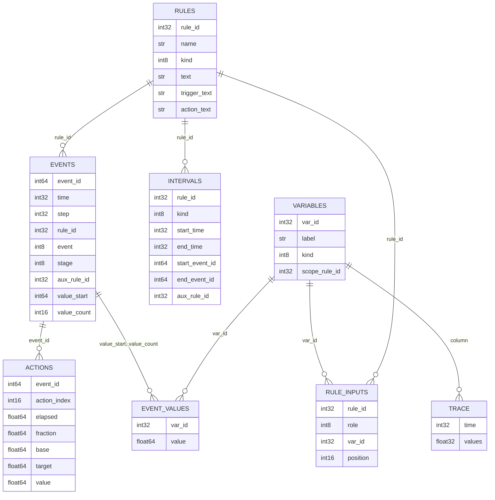
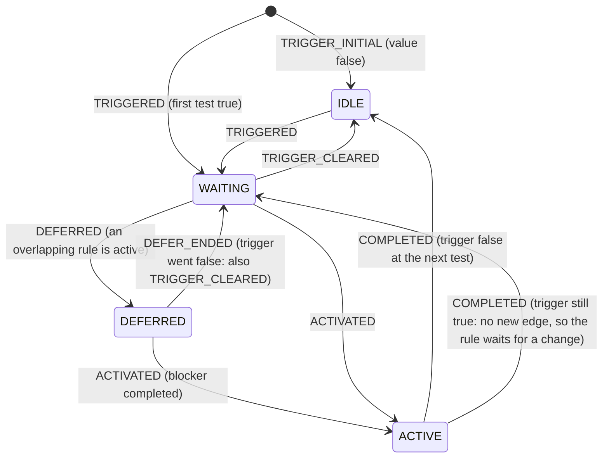

# oprule log in HDF5: plan

Status: **plan only, nothing is implemented** (written 2026-09-30). Implementation starts when the owner says so. This document records the design thinking and the open questions; the text log it extends is described in [OPRULE_REFERENCE.md](OPRULE_REFERENCE.md) B10.

## 1. Why, and what the text log already does

The text log (`oprule_log.txt`) now writes only changes: a rule's trigger value changing (with the inputs that caused it), activation, deferral, completion, and optionally every action advance. For the historical study that is about 430 KB for four months at level 1 and 650 KB at level 2 (about 18 MB for ten years at level 2). So the old size problem (a record per rule per step, 212 MB for four months) is gone, and HDF5 is no longer needed just for size.

What a text log cannot do well, and HDF5 can:

1. **Ask questions without parsing.** "Show me every time rule X was active", "which rules were deferred by X", "plot stage against the threshold at every TRIGGERED of rule Y" are table queries in HDF5 and regular-expression work on text.
2. **Show the inputs around a change, not only at it.** The text log records the inputs at the instant of a change. To understand why a threshold was crossed one wants the input series before and after. Writing that as text is too big; as a compressed dense array it is cheap (section 6).
3. **Make the stage changes obvious.** Intervals (trigger true, deferred, active) per rule can be stored as rows and drawn as a timeline (section 5).
4. **Be exact.** Numbers are stored as binary values, not as 9 significant digits of text.
5. **Sit next to the other outputs.** The model's results are already HDF5 (the tide file), so analysis tools (for example dsm2ui) can read the rule log the same way.

The text log stays. It is the format you can read in an editor and diff, and it is what the unit tests check today.

## 2. Principles

- **One event model, two writers.** The code builds one structured event (time, rule, event type, stage, inputs, action values) and hands it to one or both writers (text, HDF5). The text line is produced from that same structure, so the two formats cannot drift apart. An acceptance test converts an HDF5 log back to text and compares it with the text log of the same run.
- **Strings once.** Variable labels, rule names and rule text are stored once in dictionary tables. Event rows carry only integers and numbers.
- **Only changes** (decided): a row is written when something changes. Optional dense input traces are a separate, explicitly requested dataset.
- **No effect on the model.** Same rule as for the text log: the writer reads values, never evaluates a stateful node, never tests a trigger again. The system test (OPRULE_TEST_PLAN.md section 13) must pass with the HDF5 writer on.
- **Crash safe enough.** The model calls `exit()` on input errors and may be killed on a cluster. The writer flushes regularly and at process exit.

## 3. File and layout

A separate file next to the run, `oprule_log.h5`. Alternatives considered:

| Option | For | Against | Decision |
|---|---|---|---|
| Separate file | No contention with the tide file writer (Fortran HDF5 calls); can be deleted or copied on its own; easy to open while the model runs | One more file | **Chosen** |
| Group `/hydro/oprule_log` in the tide file | One file per run | The tide file is opened and flushed from Fortran; two writers on one file is fragile; the tide file is 12 GB for ten years | Not now. A link or a copy step could be added later |

Layout (all datasets one-dimensional, extendable, chunked, shuffle plus deflate level 4; `str` means a variable-length UTF-8 string):



Root attributes: `format_version` (starts at 1), `model_version`, `study`, `created`, `run_start`, `run_end`, `time_step_seconds`, `time_epoch` (julian minutes, 01JAN1900 00:00 = 1440), `log_level`, `source` (the hydro input file).

### 3.1 `/rules` (static, one row per rule or named expression)

`rule_id` (1-based, pool order, the same order as `manageActivation`), `name`, `kind` (0 rule, 1 named expression), `text` (full text as parsed), and for rules `trigger_text` and `action_text` (split at `WHEN`). Written once at load time.

### 3.2 `/variables` (static dictionary)

Every distinct thing that can appear as an input value: `var_id`, `label` (for example `chan_stage(int_channel=1,dist=0)`, `ts(name=mscs_op)`, `mscs_calc`, `accumulate.sum`), `kind` (0 model read, 1 named expression, 2 internal state of a node, 3 action interface), `scope_rule_id` (0 when shared by all rules; the rule's id for internal state such as `accumulate.sum`, whose value belongs to one rule). Shared reads are stored once however many rules use them.

### 3.3 `/rule_inputs` (static)

`rule_id`, `role` (0 trigger, 1 action target, 2 action state), `var_id`, `position`. It says which variables each rule depends on without repeating labels in every event, and gives the column set for the input trace.

### 3.4 `/events` (append only, one row per logged change)

| Column | Meaning |
|---|---|
| `event_id` | Row number, 0-based (implicit index; stored so other tables can refer to it) |
| `time` | Model time at the end of the step, julian minutes (int32), as in `get_model_time` |
| `step` | Step counter since the start of the run (int32) |
| `rule_id` | Which rule |
| `event` | Code: 1 TRIGGER_INITIAL, 2 TRIGGERED, 3 TRIGGER_CLEARED, 4 ACTIVATED, 5 DEFERRED, 6 DEFER_ENDED, 7 COMPLETED, 8 NOT_APPLICABLE, 9 IGNORED, 10 REPLACED (the same names as the text log) |
| `stage` | The rule's stage **after** the event (section 4), so "all stage changes" is just this table |
| `aux_rule_id` | The other rule involved: the blocker for DEFERRED, the replacing rule for REPLACED, else 0 |
| `value_start`, `value_count` | A slice of `/event_values`: the inputs captured with this event |

### 3.5 `/event_values` (append only, flat)

`var_id` and `value` (float64) pairs. An event refers to its inputs by slice. Typical events carry 1 to 6 pairs. This is the compressed-sparse-row layout: no per-row padding, no per-row strings.

What an event captures:

| Event | Captured values |
|---|---|
| TRIGGER_INITIAL, TRIGGERED, TRIGGER_CLEARED | the trigger inputs: model variables read, named expression values, internal state of stateful nodes (`accumulate.sum`, `predict.*`, `pid.*`) |
| ACTIVATED | the action target inputs, and the action state in `/actions` (init value, duration, elapsed 0) |
| DEFERRED, DEFER_ENDED, COMPLETED | nothing (the rows around them have the numbers) |

### 3.6 `/actions` (level 2, one row per action advance)

`event_id` is not used here (advances are not stage changes); the row instead carries `time`, `step`, `rule_id`, `action_index` (position in a compound action), `interface_var_id` (the label of what is written, from the dictionary), `elapsed`, `fraction`, `base`, `target`, `value`, `init`, `duration`, and a `value_start`/`value_count` slice for the target inputs. It is the HDF5 form of the text `ACTION` record.

### 3.7 `/intervals` (derived online, one row per closed interval)

The writer keeps three bits of open state per rule (87 rules in the historical study) and writes a row when an interval closes: `kind` (0 trigger true, 1 deferred, 2 active), `start_time`, `end_time`, `start_event_id`, `end_event_id`, `aux_rule_id` (blocker for deferred). Intervals still open at the end of the run are closed with `end_time` = last step and a flag in an attribute. This is what makes the stage changes obvious: a timeline per rule is one query and one bar chart (section 5).

### 3.8 `/trace` (optional, level 3, dense)

For plotting inputs around the changes. A 2-D dataset `values[step_row, column]` (float32) with one column per distinct variable in `/variables` of kind 0 or 1 that some rule uses, plus the `time` column. Written every `oprule_log_trace_interval` steps (default 1, can be 3 for 15 minutes). Rough size for the historical study: about 100 variables, 288 steps a day: 4 months is 35 000 rows x 100 x 4 bytes = 14 MB before compression, usually several times smaller after shuffle and deflate; ten years about 0.5 GB before compression. The values are plain reads of the model (stateless leaves), taken once per step after the trigger tests.

## 4. Stage model

The stage column gives each rule a single easily plotted state:



`WAITING` means the trigger is true and the rule has not started yet (for one step normally, longer when deferred). The stages are written as small integers (0 IDLE, 1 WAITING, 2 DEFERRED, 3 ACTIVE). A reader can reconstruct them from the events, but storing them makes "when did stage change" a column filter.

A known blind spot is inherited from the runtime and is not hidden by the log: a rule is not tested while it is active (OPRULE_REFERENCE.md B9 item 18), so a trigger change during activation is seen at the first test afterwards and the log records that time.

## 5. Reading it: a timeline per rule

Tools to write with the implementation (plain Python, `h5py`, optional `pandas`; the format is the contract, so any language can read it):

- `oprule_log_dump`: HDF5 to text, identical to the text log of the same run (the equivalence test).
- `oprule_log_timeline.py <file> [rule ...]`: draws one row per rule with bars for trigger true, deferred (labelled with the blocker) and active, from `/intervals`.
- `oprule_log_card.py <file> <rule> [time]`: for one rule, lists each change with the input values (names and numbers) and, with a trace, plots the inputs from some steps before to some steps after, with the threshold in the rule text noted.

A simple example, the same rule in both formats (values from the historical study):

Text log:

```
2014-09-03 07:25 | TRIGGERED | mscs_close | trigger_inputs=[mscs_velclose=1; chan_vel(int_channel=484,dist=5750)=-0.140688087; mscs_calc=1; ts(name=mscs_op)=-10]
2014-09-03 07:25 | ACTIVATED | mscs_close | interface=gate_op(gate=13,device=4,direction=from_node) mode=time_dependent init=live duration=0 elapsed=0 target_inputs=[]
```

HDF5 rows (ids are illustrative):

```
/rules      rule_id=41  name=mscs_close  text="mscs_close := SET gate_op(...) TO 0.0 WHEN (mscs_velclose AND mscs_calc) OR (mscs_g3close);"
/variables  var_id=12 label=chan_vel(int_channel=484,dist=5750)  kind=0
            var_id=13 label=ts(name=mscs_op)                     kind=0
            var_id=14 label=mscs_velclose                        kind=1
            var_id=15 label=mscs_calc                            kind=1
/events     event_id=907 time=<julmin of 07:25> step=1229 rule_id=41 event=2 (TRIGGERED) stage=1 value_start=4412 value_count=4
            event_id=908 time=<same>            step=1229 rule_id=41 event=4 (ACTIVATED) stage=3 value_start=4416 value_count=0
/event_values  [4412] var=14 value=1   [4413] var=12 value=-0.140688087   [4414] var=15 value=1   [4415] var=13 value=-10
/intervals  rule_id=41 kind=0 (trigger true) start_time=07:25 end_time=11:25 ...
```

One event is about 32 bytes plus 12 bytes per captured value, before compression, against about 300 bytes of text for the same two records.

## 6. Code structure for the implementation

- Replace `RuleLog::write(level, event, rule, detail)` by a structured call that takes an event object (time, step, rule id, event code, stage, aux rule, inputs as `StateList`, action fields). `RuleLog` keeps the level and the context, and forwards the event to its sinks.
- `TextSink` (what exists now, produced from the event) and `Hdf5Sink` (new). A rule name is mapped to `rule_id` once at load time; a variable label is mapped to `var_id` on first use (the dictionary grows as events arrive, and is complete for `/rule_inputs` once the first step has run).
- `Hdf5Sink` buffers events and values in memory and appends in chunks (about 4096 rows); `flush()` at the end of every simulated day and from an `atexit` hook, so `exit(-3)` after an input error still leaves a readable file. Optional SWMR (single writer, multiple readers) mode lets a script follow a run in progress.
- Build: HDF5 is already a dependency of the full DSM2 build. The standalone oprule test project does not have it, so the HDF5 sink is compiled only with `OPRULE_WITH_HDF5` (on in the full build, off by default in the standalone project). The tests that need it form a separate program that reads the file back with the HDF5 C API.
- Fortran side: scalars `oprule_log_format` (`text`, `hdf5`, `both`; default `text`) and `oprule_log_trace_interval` (0 off), read through `model_interface.f90` the way `get_oprule_log_level` is. `oprule_log_level` keeps its meaning for both formats (1 events, 2 plus actions); the dense trace is requested separately because it is not an "event".
- The event model also fixes a loose end: today `rule_id` is the rule name string, and names are only unique per run because the parser refuses duplicates.

## 7. Tests planned

| ID | Test |
|---|---|
| H5-01 | Unit: write a synthetic event stream, read it back with the HDF5 C API, compare every column and the dictionary |
| H5-02 | Equivalence: for each existing text-log unit test scenario, the HDF5 file converted by `oprule_log_dump` equals the text log |
| H5-03 | The same on the system test run (both formats on): `oprule_log_dump` of the HDF5 file equals `oprule_log.txt` |
| H5-04 | Intervals: closed intervals match the event sequence (trigger true from TRIGGERED to TRIGGER_CLEARED, active from ACTIVATED to COMPLETED, deferred with the blocker); a rule still active at the end is closed and flagged |
| H5-05 | Stage column equals the stage reconstructed from the events by the reader |
| H5-06 | Crash safety: a run that calls `exit()` leaves a file that opens and holds every event before the exit |
| H5-07 | No effect on the model: the system test passes with `hdf5` and `both` (tide file identical, run log identical) |
| H5-08 | Trace: columns match the dictionary; at an event time the trace row equals the inputs captured in the event |
| H5-09 | Size and overhead: file size per event and run time against the off run, recorded in the system test report |
| H5-10 | Format version: a reader refuses a `format_version` it does not know |

## 8. Open questions for the owner

1. **Dense trace**: wanted? It is the only part that is large, and the only way to see an input before it reaches a threshold. Default off, interval configurable.
2. **File name and place**: `oprule_log.h5` in the working directory (as the text log), or inside the study output directory?
3. **Both formats at once**: should `both` exist, or is it `text` or `hdf5`? (`both` is what the equivalence test needs.)
4. **Names versus ids in the rule text**: gates and devices appear as Fortran indices (`gate_op(gate=13,device=4,...)`) because the interfaces keep no names. An HDF5 log could add a name dictionary from the model (gate and device names, channel external numbers) written once at start. This needs a small Fortran accessor (a name for a gate index, a device index and an internal channel). Worth doing with this step?
5. **Where analysis tools live**: in this repository (`oprule/tools`), or in dsm2ui?
6. **Inputs of stateful rules at every step**: the trace covers model reads. If internal state (accumulate, PID) should also be traced per step, say so; it needs a per-rule scope in the trace columns.

## 9. Order of work (after approval)

1. Event model and `TextSink` refactor, all current tests unchanged and passing.
2. `Hdf5Sink` with the static tables, `/events`, `/event_values`; H5-01, H5-02, H5-10.
3. `/actions`, `/intervals`, stage column; H5-04, H5-05.
4. Fortran scalars, `atexit` flush; H5-06.
5. System test with `both`; H5-03, H5-07, H5-09.
6. Dense trace and the plotting tools; H5-08.
